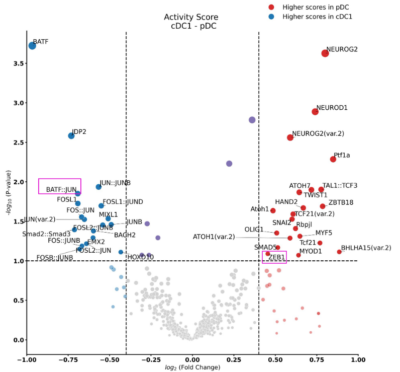

# Tutorial – Differential Footprints on Dendritic Cell specification

In this tutorial, we will show how to use HINT-ATAC to compare changes in the activity of transcription factors with differential footprinting. We will use this data presented at HINT-ATAC paper, where we contrast the footprints of two dendritic cells. In short, we cultured classical DC type1 (cDC1) and plasmacytoid DC (pDC) from mouse bone marrow and performed Omni ATAC-seq experiment (original data is deposited in [GEO](https://www.ncbi.nlm.nih.gov/geo/query/acc.cgi?acc=GSE118221)).

We have performed low-level analysis steps including reads alignment with Bowtie2 and peaks calling with MACS2.

1. Download the data [here](https://costalab.ukaachen.de/open_data/hint/tutorial/DendriticCells.tar.gz) and extract the pre-processed data with the following commands:

```shell
tar xvfz DendriticCells.tar.gz
cd DendriticCells
```

2. Execute the following commands to call footprints for cDC1 and pDC cells:

```shell
rgt-hint footprinting --atac-seq --paired-end --organism=mm9 --output-location=./ --output-prefix=cDC1 cDC1.bam cDC1_peaks.narrowPeak 
rgt-hint footprinting --atac-seq --paired-end --organism=mm9 --output-location=./ --output-prefix=pDC pDC.bam pDC_peaks.narrowPeak
```

HINT requires a bam file (indexed and sorted) and peaks as input. HINT only considers peak regions for footprinting to speed up the analysis. Each command will generate an output file in the current folder, containing the genomic locations of the footprints. HINT-ATAC (pDC.bed and cDC1.bed for the example above). It also produces a file with ending “.info”, which has statistics from the libraries, i.e. the total number of reads and so on.

When –paired-end is specified, HINT-ATAC filter signals by only considering cleavage events from paired-ends with a particular size range.  This option is recommended given significant improvement in footprint prediction (see our paper).   You also need to specify the genome/organism with the flag –organism. See [this](https://reg-gen.readthedocs.io/en/latest/rgt/setup_data.html) for supported genomes or perform the command bellow for a complete description of HINT parameters:

3. HINT also outputs signals for visualization in a genome browser. For this, you can use a special HINT command to generate genomic profiles ([BigWig](https://genome.ucsc.edu/goldenpath/help/bigWig.html) files).

```shell
rgt-hint tracks --bc --bigWig --organism=mm9 cDC1.bam cDC1_peaks.narrowPeak  --output-prefix=cDC1_BC
rgt-hint tracks --bc --bigWig --organism=mm9 pDC.bam pDC_peaks.narrowPeak  --output-prefix=pDC_BC
```

This bigwig file contains the number of ATAC-seq reads at each genomic position as estimated by HINT-ATAC after signal normalization and cleavage bias correction. Note that this command currently only supports bias correction and shifts of ATAC-seq. This is more accurate than simply looking a coverage profiles of a bam file.


Open all bigwig and footprint files (bed) generated above in a genome browser, e.g. IGV. Remember these experiments are based on mouse genome **mm9**. Check for example the genomic profiles around the gene Zbtb46 in the below, which is expressed by cDC but not by pDC. We observe that this gene has several open chromatin regions for these two cell types, but one particular region has cDC1 specific footprints.


4. One of the main applications of footprinting is to find TFs associated with a particular cellular condition. We can do this by first finding motifs overlapping with predicted footprints. RGT suite also offers a tool for finding motif predicted binding sites (MPBS) with JASPAR, UNIPROBE or HOCOMOCO motifs.

Execute the following commands to do motif matching for footprints using motifs from [JASPAR](https://jaspar.genereg.net/) as default:

```shell
rgt-motifanalysis matching --organism=mm9 --input-files pDC.bed cDC1.bed
```

where pDC.bed and cDC1.bed are the footprint predictions obtained in step 2. Depending on the number of footprints and the size of the motif database, the previous command requires a long computation time. The above commands will make a folder named match and generate a BED file for each input file, containing the matched motif instances for each footprint region. The 4th column contains the motif name and the 5th column the bit-score of the motif match. Check [here](https://reg-gen.readthedocs.io/en/latest/motif_analysis/introduction.html) for more details about motif matching.

5. Finally, we use HINT to generate average ATAC-seq profiles around binding sites of particular TF. This analysis allows us to inspect the chromatin accessibility for each particular TF. Moreover, by comparing the cleavage profiles from two ATAC-seq libraries (i.s. cDC1 vs pDC cells ), we can get insights on changes in binding in two cells. For this, execute the following commands:

```shell
rgt-hint differential --organism=mm9 --bc --nc 30 --mpbs-files=./match/cDC1_mpbs.bed,./match/pDC_mpbs.bed --reads-files=cDC1.bam,pDC.bam --conditions=cDC1,pDC --output-location=cDC1_pDC
```

The above command will read the motif matching files generated by step 4 and BAM files which contain the sequencing reads to perform the comparison. Note that here we specify –bc to use the bias-corrected signal (currently only  ATAC-seq is supported). The command –nc allow parallel execution of the job.

After the command is done, a new folder ‘cDC1_pDC’ will be created. Inside it, a scatter plot can be found, which shows the transcription factor (TF) activity dynamics between cDC1 and pDC as shown below.  The y-axis represents the differences in TF activity and names of TFs with significant differential activity values are colored as red (x-axis is a random number for jittering purposes).



Each point represents a factor, but we only label TFs with a significant change in activity score (p-value < 0.05). These statistics can be obtained from file cDC1_pDC_statistics.txt. From the above plot, we can see that motif BATF::JUN and Zeb1 show significant differences, suggesting that they are related to [cDC1](https://www.nature.com/articles/ni.3197) and [pDC](https://www.sciencedirect.com/science/article/pii/S0092867408011380), respectively.

In addition,  a folder called lineplot can be found, which contains the ATAC-seq profile for each of the motifs found in the mpbs bed files. Let’s check the profiles of these two factors,  you will see that BATF has a higher number of ATAC-seq counts in cDC1 cells, while Zeb1 has more ATAC-seq in pDC cells. Higher ATAC-seq signal indicates the higher activity of the factor in that particular cell. Other known DC factors identified by HINT-ATAC include [Spi1](https://academic.oup.com/nar/article/43/20/9680/1396036?login=false) (also referred as PU.1 or SFPI1), which is a master regulator of DC differentiation and mostly active in cDC.

  

