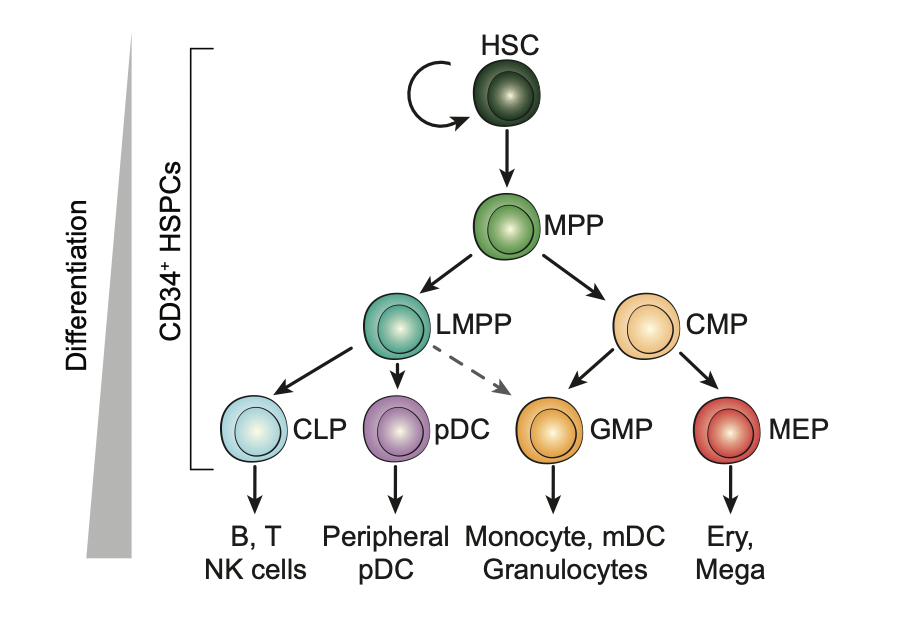
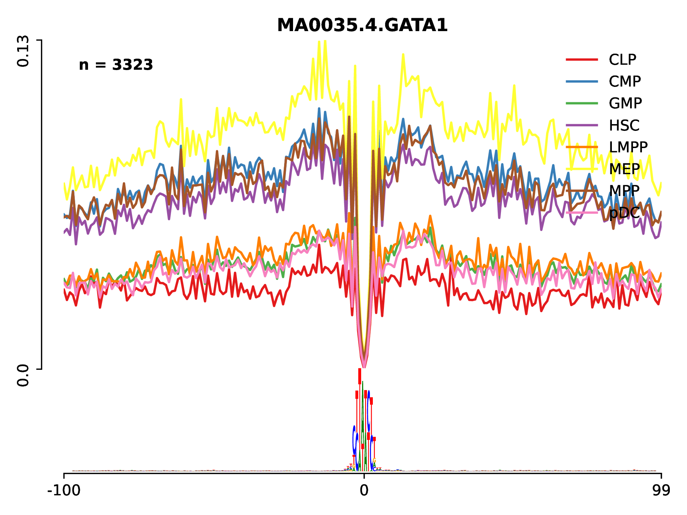
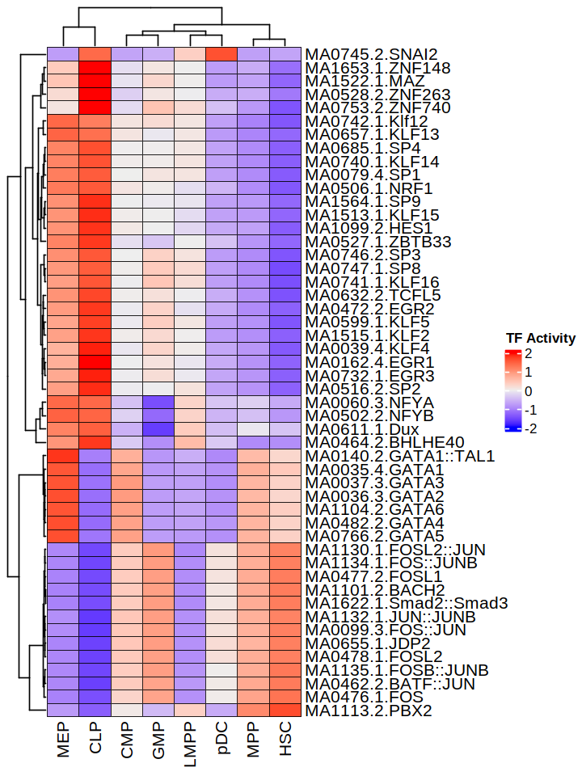

# Tutorial –  Differential Footprints on single-cell ATAC-seq

Analysis of single-cell chromatin accessibility data allows us to detect novel cell clusters, while how to interpret these clusters remains a challenge. In this tutorial, we will show how to use HINT-ATAC to compare transcription factor binding activity based on differential footprinting analysis. We will use a public scATAC-seq dataset from [human hematopoietic cell](https://www.cell.com/cell/fulltext/S0092-8674(18)30446-X).

## Biological backgroud
Human hematopoietic stem cells give rise to all blood cells through a continuous differentiation which involves remarkable changes of gene regulation. The transcription factors (TFs) play an important role during this process. Below is a schematic showing the classical definition of human hematopoietic differentiation (Source: Buenrostro, Jason D., et al (2018) ). 



## Identifty cell-type-specfic TFs with footprinting analysis
ATAC-seq (Assay for Transposase-Accessible Chromatin using sequencing) is a simple and sensitive protocol for profiling genome-wide chromatin accessibility based on Tn5 transposition. In this process, the DNA sequences directly bound by TFs are protected from transposition thus leaving a footprint. We will utilize this information to identify TF binding sites and compare TF activity across distinct biological conditions. Prior to this, please ensure that you have installed RGT and setup the data successfully. See [here](https://reg-gen.readthedocs.io/en/latest/rgt/installation.html) for instructions.

1. Download the data [here](https://costalab.ukaachen.de/open_data/scOpen/HematopoieticCells/HematopoieticCells.tar.gz) and extract the pre-processed data with the following commands:

```shell
tar xvfz HematopoieticCells.tar.gz
cd HematopoieticCells
```

Inside the directory, you will find a sub-folder called BAM which includes BAM filles for all the cell types that we would like to analyze.

2. To predict TF binding sites, we need a peak file for each of the BAM files. Here we will do the peak calling using [MACS2](https://genomebiology.biomedcentral.com/articles/10.1186/gb-2008-9-9-r137):

```shell
## create a folder for peaks
mkdir Peaks

## loop through all BAM files and call the peaks
for celltype in CLP CMP GMP HSC LMPP MEP MPP pDC;
do
macs2 callpeak -t ./BAM/${celltype}.bam -n ${celltype} --outdir ./Peaks -g hs --nomodel -f BAMPE -q 0.01 --keep-dup all
sed -i '/random\|chrUn\|chrM/d'./Peaks/${celltype}_peaks.narrowPeakdone
done
```

3. Execute the following commands to call footprints for all the cell types:
```shell
mkdir Footprints

for celltype in CLP CMP GMP HSC LMPP MEP MPP pDC;
do
rgt-hint footprinting --atac-seq --paired-end --organism=hg19 \
--output-location=./Footprints \
--output-prefix=${celltype} \
./BAM/${celltype}.bam ./Peaks/${celltype}_peaks.narrowPeak
done
```

HINT only considers peak regions for footprinting to speed up the analysis. For each cell type, this will generate a BED file containing the genomic locations of the footprints under the Footprints folder. It also produces a file with ending “.info”, which has statistics from the libraries, i.e. the total number of reads and so on.

When –paired-end is specified, HINT-ATAC filter signals by only considering cleavage events from paired-ends with a particular size range.  This option is recommended given a significant improvement in footprint prediction (see our paper). You also need to specify the genome/organism with the flag –organism. See [this](https://reg-gen.readthedocs.io/en/latest/rgt/setup_data.html) for supported genomes or perform the command bellow for a complete description of HINT parameters:

```shell
rgt-hint footprinting --help
```

**NOTE**: this is the most time-consuming step, and to speed it up, you can run the above command for each cell type at the same time.

4. One of the main applications of footprinting is to find TFs associated with a particular cellular condition. We can do this by first finding motifs overlapping with predicted footprints. RGT suite also offers a tool for finding motif predicted binding sites (MPBS) with JASPAR, UNIPROBE or HOCOMOCO motifs. Execute the following commands to do motif matching for footprints using motifs from [JASPAR](http://jaspar.genereg.net/) as default:

```shell
mkdir MotifMatching

for celltype in CLP CMP GMP HSC LMPP MEP MPP pDC;
do
rgt-motifanalysis matching \
--organism=hg19 \
--output-location=./MotifMatching \
--input-files ./Footprints/${celltype}.bed
done
```

The above commands will generate a BED file for each input file, containing the matched motif instances for each footprint region. The 4th column contains the motif name and the 5th column the bit-score of the motif match. Check [here](https://reg-gen.readthedocs.io/en/latest/motif_analysis/introduction.html) for more details about motif matching.

5. Finally, we use HINT to generate average ATAC-seq profiles around binding sites of particular TF. This analysis allows us to inspect the chromatin accessibility for each particular TF. Moreover, by comparing the cleavage profiles from different ATAC-seq libraries, we can get insights on changes in binding in two cells. For this, execute the following commands:

```shell
mkdir -p DiffFootprinting

rgt-hint differential --organism=hg19 --bc --nc 64 \
--mpbs-files=./MotifMatching/CLP_mpbs.bed,\
./MotifMatching/CMP_mpbs.bed,\
./MotifMatching/GMP_mpbs.bed,\
./MotifMatching/HSC_mpbs.bed,\
./MotifMatching/LMPP_mpbs.bed,\
./MotifMatching/MEP_mpbs.bed,\
./MotifMatching/MPP_mpbs.bed,\
./MotifMatching/pDC_mpbs.bed \
--reads-files=./BAM/CLP.bam,./BAM/CMP.bam,./BAM/GMP.bam,\
./BAM/HSC.bam,./BAM/LMPP.bam,./BAM/MEP.bam,./BAM/MPP.bam,\
./BAM/pDC.bam \
--conditions=CLP,CMP,GMP,HSC,LMPP,MEP,MPP,pDC \
--output-location=./DiffFootprinting --output-prefix=All
```

The above command will read the motif matching files generated by last step and BAM files which contain the ATAC-seq to estimate a cell-type-specific binding activity score for each TF. We can use this to identify important TFs as shown below. Note that here we specify –bc to use the bias-corrected signal (currently only  ATAC-seq is supported). The command –nc allows parallel execution of the job.

After the command is done, a new folder **DiffFootprinting** will be created. Under this directory, there is a sub-folder called Lineplots which includes all the line plots for visualization of the TF footprint profiles. For example, we can check the activity of GATA1 which is know to be relevant for megakaryocyte-erythroid progenitro (MEP) cells differentiation:



6. To summarize all TF activity between distinct conditions, we can generate a heatmap using the data from **All_statistics**.txt. This file contains a tag count  and protection score for each conditon and cell type.



Based this result, we can identify more cell-type-specific TFs. The code for generating the heatmap is found [here](../_static/hint/plot_heatmap.html).