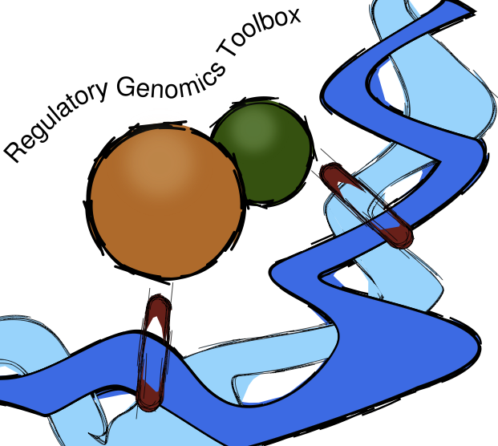

.. RGT documentation master file, created by
   sphinx-quickstart on Mon Jul  4 13:14:44 2022.
   You can adapt this file completely to your liking, but it should at least
   contain the root `toctree` directive.

RGT - Regulatory Genomics Toolbox
===================================

RGT is an open source Python 3.6+ library for analysis of regulatory genomics. 
It is programmed in an oriented object fashion and its core classes provide functionality for handling regulatory genomics data.

This project is developed and maintained by `Institute for Computational Genomics <http://www.costalab.org/>`__ , RWTH University Hostpital. 
If you have any questions/comments/problems, please open an issue on `Github <https://github.com/CostaLab/reg-gen>`__.

The toolbox is made of a core library and several tools:

- `HINT <https://reg-gen.readthedocs.io/en/latest/hint/introduction.html>`__: ATAC-seq/DNase-seq footprinting method
- `Motif Analysis <https://reg-gen.readthedocs.io/en/latest/motif_analysis/introduction.html>`__: TBFS match and enrichment
- `THOR <https://reg-gen.readthedocs.io/en/latest/thor/introduction.html>`__: ChIP-Seq differential peak caller
- `TDF <https://reg-gen.readthedocs.io/en/latest/tdf/introduction.html>`__: DNA/RNA triplex domain finder
- `RGT-Viz <https://reg-gen.readthedocs.io/en/latest/rgt-viz/introduction.html>`__: Visualization tool

.. toctree::
   :caption: RGT
   :maxdepth: 2
   :hidden:

   rgt/introduction.md
   rgt/installation.md
   rgt/setup_data.md
   rgt/tool_usage.md
   rgt/tutorial-peak-calling.md

.. toctree::
   :caption: HINT
   :maxdepth: 2
   :hidden:
   
   hint/introduction.md
   hint/tutorial-single-cell.md
   hint/tutorial-dendritic-cell.md

.. toctree::
   :caption: Motif analysis
   :maxdepth: 2
   :hidden:
   
   motif_analysis/introduction.md
   motif_analysis/tutorial.md
   motif_analysis/tool_usage.md
   motif_analysis/motif_data_configration.md
   motif_analysis/add_new_motif_repository.md

.. toctree::
   :caption: THOR
   :maxdepth: 2
   :hidden:
   
   thor/introduction.md
   thor/tool_usage.md

.. toctree::
   :caption: TDF
   :maxdepth: 2
   :hidden:
   
   tdf/introduction.md
   tdf/method_description.md
   tdf/tutorial_for_genomic_region_test.md
   tdf/tutorial_promoter_test.md
   tdf/tool_usage.md

.. toctree::
   :caption: RGT-VIZ
   :maxdepth: 2
   :hidden:
   
   rgt-viz/introduction.md
   rgt-viz/method.md
   rgt-viz/tool_usage.md
   rgt-viz/tutorial_regions_vs_regions.md
   rgt-viz/tutorial_regions_vs_signals.md

