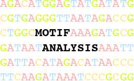

# Introduction



## Method
We provide a flexible framework to perform operations related to motif analyses. Currently, the following analyses are available:

### Motif Matching
Matches a set of transcription factor motifs found on the main repositories (such as [Jaspar](http://jaspar.genereg.net/), [Uniprobe](http://the_brain.bwh.harvard.edu/uniprobe/) and [Hocomoco](http://autosome.ru/HOCOMOCO/)) against a set of genomic regions of interest.

The search is performed using a PSSM (Position-Specific Scoring Matrix), which is a normalized/background-corrected version of a simple PFM (Position Frequency Matrix), which contains the frequency that each nucleotide happens in each position of the motif. Such structure (PSSM) is matched to every position within the regions of interest in the selected genome. This will generate a score for every position in which the PSSM was applied, which can be interpreted as the binding affinity of such cis-acting element to such positions.

In order to define a cutoff in which to accept/reject motif instances based on the affinity score evaluated we use a False Positive Rate approach (FPR). In this criterion, the distribution of scores for a particular PSSM is estimated based on a dynamic programming algorithm. Then a cutoff can be established based on a user-selected p-value. Best results can be achieved with p-values between 10^(-5) to 10^(-3).

### Motif Enrichment

Evaluate the enrichment of transcription factors in certain genomic regions. After performing motif matching of transcription factors in certain regions, we can evaluate which transcription factors are more likely to occur in those regions than in “background regions”. There are three types of test available:

1. Input regions vs. Background regions: In this test, all input regions are verified against background genomic regions. These background regions are either user-provided, or random genomic regions generated during “matching” with the same average length distribution of the original input regions. It is highly recommended that the number of background regions to be at least 10 times the number of original regions for statistical significance. A [Fisher’s exact test](https://en.wikipedia.org/wiki/Fisher's_exact_test) is performed for each transcription factor with the following criteria:
* A = number of input regions with at least 1 occurrence of that particular transcription factor.
*  B = number of input regions with no occurrence of that particular transcription factor.
* C = number of random background regions with at least 1 occurrence of that particular transcription factor.
* D = number of random background regions with no occurrence of that particular transcription factor.

After performing the Fisher’s exact test with the variables above, the results for all transcription factors are corrected for multiple testing with the [Benjamini-Hochberg procedure](https://en.wikipedia.org/wiki/False_discovery_rate#Benjamini.E2.80.93Hochberg_procedure).

2. Gene-associated regions vs. Non-gene-associated regions: In some particular analyses, we want to check whether a group of regions that are associated with genes of interest (e.g. up-regulated genes) are enriched for some transcription factors vs. regions that are not associated to those genes. In this case we perform a gene-region association in order to divide our input regions into these two groups. This association considers promoter-proximal regions, gene body and distal regions. After the association, we perform a Fisher’s exact test followed by multiple testing correction as mentioned in the previous analysis type.

3. Promoter regions of input genes vs. Background regions: If a gene list is provided outside of the context of the “gene association test” (ie, NOT in the experimental matrix) then a promoter test is performed. We take all provided genes, find their promoter regions in the target organism and create a “target regions” BED file from those. Motif matching is then performed on the target regions and the provided background. In this case, three ways of specifying background are available: as a normal BED file, randomly generated or with the **--make-background** options, a newly-generated background made of the promoter regions of all genes not included in the provided gene list. Note that is usually a big task so it might take a long time, and require a lot of memory.

Which analysis to use is determined by both the input and the options used. Please refer to the [tutorial](https://reg-gen.readthedocs.io/en/latest/motif_analysis/tutorial.html) and the [tool usage](https://reg-gen.readthedocs.io/en/latest/motif_analysis/tool_usage.html) page to understand how to perform either of these three.

## Installation

You can follow the general installation instructions for the [RGT](https://reg-gen.readthedocs.io/en/latest/rgt/installation.html) suite, which will automatically install the MotifAnalysis tool with all its dependencies.

After that, you must setup your [RGT Data folder](https://reg-gen.readthedocs.io/en/latest/rgt/setup_data.html), unless you have already done it.

Specifically for Motif Analysis, you also need to create the Weblogos in the RGT Data folder, otherwise they will be missing from the enrichment files. More details [here](https://reg-gen.readthedocs.io/en/latest/motif_analysis/additional_motif_data.html), but the simple command is (within the rgtdata folder):
```shell
python setupLogoData --all
```

Further installation instructions, including installation without pip, are found [here](https://reg-gen.readthedocs.io/en/latest/rgt/installation.html).