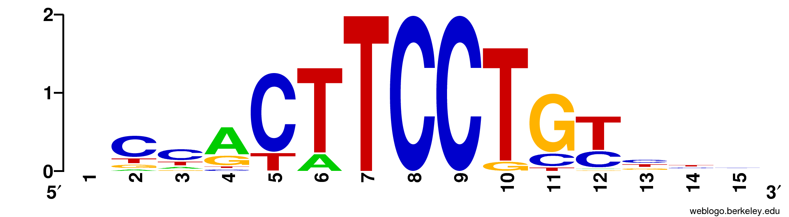

# Motif Data Configuration

When RGT is installed, it will automatically create a folder to store additional data (default: ~/rgtdata). Within the subfolder motifs, files related to the motif analysis tool will be added: position frequency matrices (describing transcription factor motifs), files needed for the HTML report, etc.

What is not included is the “Motif Logos”, a graphical representation of TF binding affinity (ie, of the PWMs), like this one:



In this section we will describe how to create the motif logos and the various ways they can be added to the final HTML report. We will also explain how to add additional motif repositories, both from known sources (JASPAR, Hocomoco) and your own hand-crafted ones.

## Create Motif Logos
```shell
# move inside your RGTDATA folder
cd ~/rgtdata

# run this to generate logos for all available repositories
python setupLogoData.py --all
```

After this, your directory tree should look somewhat like this:
```shell
├── fig
├── fp_hmms
├── hg19
├── hg38
├── lib
├── logos
│   ├── hocomoco
│   ├── jaspar_vertebrates
│   ├── uniprobe_primary
│   └── uniprobe_secondary
├── mm10
├── mm9
├── motifs
│   ├── hocomoco
│   ├── jaspar_vertebrates
│   ├── uniprobe_primary
│   └── uniprobe_secondary
├── zv10
└── zv9
```

Note how the directories within **motifs** match the newly created directories within **logos**.

But what if you added a new repository, **jaspar_plants**?
```shell
├── motifs
│   ├── hocomoco
│   ├── jaspar_plants
│   ├── jaspar_vertebrates
│   ├── uniprobe_primary
│   └── uniprobe_secondary
```

You wouldn’t want to re-create all the logos. So you run, instead, the following command:

```shell
# generate logos only for the jaspar_plants directory,
# as long as it exists inside the motifs directory
python setupLogoData.py jaspar_plants
```

Afterwards, your **logos** directory will look like this:
```shell
├── logos
│   ├── hocomoco
│   ├── jaspar_plants
│   ├── jaspar_vertebrates
│   ├── uniprobe_primary
│   └── uniprobe_secondary
```

Inside each of these directories you’ll see the logo images, ready for use by the Motif Analysis tool when creating the HTML report.