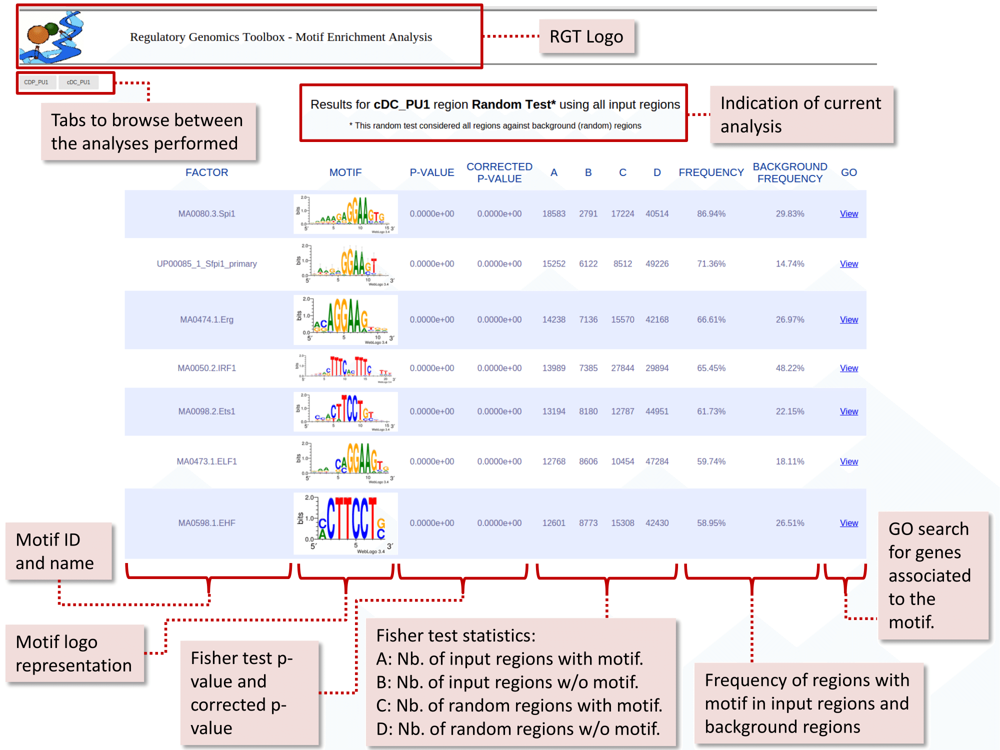

# Tutorial

## Putative Transcription Factor Binding Site Test
Here we will perform a motif enrichment analysis on the PU.1 peaks of the dendritic cell types CDP and cDC. In the end of this tutorial you should have all the putative transcription factors that are enriched in DNA sequences around PU.1 peaks of both cell types being analyzed.

First, you need to install the [Motif Analysis tool](https://reg-gen.readthedocs.io/en/latest/motif_analysis/introduction.html) and [JASPAR/UNIPROBE logo graphs](https://reg-gen.readthedocs.io/en/latest/motif_analysis/additional_motif_data.html). We assumed that you have obtained the mouse genome (mm9) using the [RGT Genomic Data](https://reg-gen.readthedocs.io/en/latest/rgt/setup_data.html), as described in the [peak calling tutorial](https://reg-gen.readthedocs.io/en/latest/rgt/tutorial-peak-calling.html). Furthermore, all commands described in this tutorial should be executed within the [RGT-Viz tutorial](https://reg-gen.readthedocs.io/en/latest/rgt-viz/tutorial.html).

The motif enrichment analysis consists of two parts. In the first part, we will perform a motif match in order to detect putative binding sites in the input regions and also in random genomic regions automatically generated by the tool. In the second part, the tool will count the number of putative binding sites inside the input and random regions and perform a statistical test to determine which transcription factors are more likely to be enriched.

#### Performing the motif matching

We are ready to perform the first step of the motif analysis, which consists of the motif matching. In this step we are going to find putative binding sites of a number of transcription factors into the genome of the mouse (mm9). To perform the motif match, type the following command:

```shell
rgt-motifanalysis --matching --organism mm9 --rand-proportion 2 --input-matrix Matrix_CDP_cDC.txt
```

Let’s check each part of the above command:

- <b>rgt-motifanalysis \-\-matching:</b> This is the motif match command call. In order to know all the options you can use in the motif match analysis please type:

```shell
rgt-motifanalysis --matching -h
```

- <b>\-\-organism mm9:</b> Set the organism being analyzed to mm9.

- <b>\-\-rand-proportion 2:</b> Since we plan to perform a motif enrichment after the matching, we also need putative binding sites at random regions. This command tells the tool to generate random putative binding sites with size two times larger than the input peak. In real scenarios this proportion should be set to 10 or more for proper statistical accuracy.

- <b>\-\-input-matrix Matrix_CDP_cDC.txt:</b> The experimental matrix for this analysis. The motif matching tool will only consider the “region” input files from the experimental matrix. For more information please refer to [this manual](https://reg-gen.readthedocs.io/en/latest/motif_analysis/tool_usage.html).

After running the motif match command, the output should be presented in a folder termed “match”. In this folder you will find the putative binding sites (MPBS; Motif-Predicted Binding Sites) for the two input regions determined in the experimental matrix, as well as for the random regions.

#### Performing the motif enrichment 
With the results of the motif matching, we can perform the motif enrichment. This analysis consists on verifying which transcription factors are enriched in our input regions. To perform the motif enrichment type the following command:

```shell
rgt-motifanalysis --enrichment --organism mm9 --input-matrix Matrix_CDP_cDC.txt match/random_regions.bed
```

Let’s check each part of the above command:

- <b>rgt-motifanalysis –enrichment:</b> This is the motif enrichment command call. In order to know all the options you can use in the motif enrichment analysis please type:

```shell
rgt-motifanalysis --enrichment -h
```
- <b>\-\-organism mm9:</b> Set the organism being analyzed to mm9.

- <b>\-\-input-matrix Matrix_CDP_cDC.txt:</b> The experimental matrix containing the input files, as in the motif matching step.

- <b>match/random_regions.bed:</b> The only required argument represents the path to the background file to use for enrichment, in this case the random regions file created at the previous step. Only the input file should be passed: the corresponding MPBS file is found automatically by the tool.

#### Results of the motif enrichment

The motif enrichment tool outputs files inside the following folder structure: \<output\_folder\>/\<name\_of\_region\>. In our example, the results will be inside: \<example\_RGT-Viz\_folder\>/cDC\_PU1 and \<example\_RGT-Viz\_folder\>/CDP\_PU1.

Let’s explore the motif enrichment output in the cDC\_PU1 folder:

- <b>mpbs\_ev.bed:</b> Contains all the putative binding sites found inside PU1 peaks of cDC cell type.
- <b>fulltest\_statistics.html and fulltest\_statistics.txt:</b> Contains the results of the analyses in HTML and txt (tab-separated) format. The HTML table looks like this:



You can observe that, as expected, PU.1 motifs were ranked in the top (UP00085\_1\_Sfpi1\_primary and MA0080.3.Spi1). Furthermore, we observed that other transcription factors were also enriched in these regions, such as Erg, IRF1, Ets1, ETF1, EHF and many others. These transcription factors are putative co-binding or regulatory partners of PU.1 and are connected with PU.1 in its regulatory network within the cDC cell type.

## Full-site Test
[Download here](https://costalab.ukaachen.de/open_data/RGT/MotifAnalysis/RGT_MotifAnalysis_FullSiteTest.tar.gz). Execute the following commands in order to perform a motif matching followed by motif enrichment:

```shell
cd RGT_MotifAnalysis_FullSiteTest
rgt-motifanalysis matching --input-files input/regions_K562.bed input/background.bed 
rgt-motifanalysis enrichment input/background.bed input/regions_K562.bed
```

In the enrichment step, the order of the bed files matters. The background must always come first.

You can also reduce the amount of motifs used via the **–filter** parameter:

```shell
rgt-motifanalysis matching --filter "species:sapiens;name:EG" [other arguments..]
rgt-motifanalysis enrichment --filter "species:sapiens;name:EG" [other arguments..]
```

This will restrict the search to only the motifs with the string “EG” in their name (by default, the search is inexact; use **–filter-type** to explore different modes) and whose “species” metadata contains the “sapiens” string.

See the help file for all the available keys:

```
rgt-motifanalysis matching --help
```

You should also look into the metadata files – [read here](https://reg-gen.readthedocs.io/en/latest/motif_analysis/additional_motif_data.html) for more information.

## Promoter Test

[Download here](https://costalab.ukaachen.de/open_data/RGT/MotifAnalysis/RGT_MotifAnalysis_PromoterTest.tar.gz). Execute the following commands in order to perform a motif matching followed by motif enrichment:
```shell
cd RGT_MotifAnalysis_PromoterTest
rgt-motifanalysis matching --target-genes input/genes.txt --input-files input/background.bed
rgt-motifanalysis enrichment input/background.bed match/target_regions.bed
```

In the enrichment step, the order of the bed files matters. The background must always come first.

### Gene association Test
[Download here](https://costalab.ukaachen.de/open_data/RGT/MotifAnalysis/RGT_MotifAnalysis_GeneAssocTest.tar.gz). Execute the following commands in order to perform a motif matching followed by motif enrichment:

```
cd RGT_MotifAnalysis_GeneAssocTest
rgt-motifanalysis matching --input-matrix input_matrix.txt --rand-proportion 10
rgt-motifanalysis enrichment --input-matrix input_matrix.txt match/random_regions.bed
```

The matching command will read the experimental matrix, which specifies the PATH to the genomic regions and the genes to make an association test on. It also creates a background made of random regions of size 10 times the biggest genomic region in input. It might take between 10 and 30 minutes to run. It if is taking too long, use **--rand-proportion 1**.

The enrichment command will calculate the enrichment statistics for the all the input regions over the random background. This step should take about 5 minutes to complete.

Further usage instructions are found [here](https://reg-gen.readthedocs.io/en/latest/motif_analysis/tool_usage.html).
