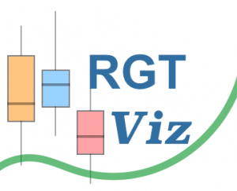
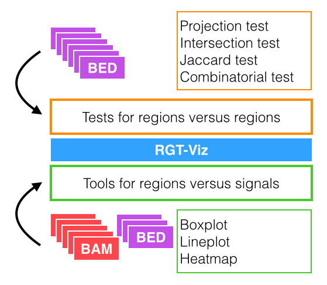

# Introduction

RGT-Viz is a collection of tests for association analysis and tools for visualizaiton of genomic data such as genomic regions and genomic signals. RGT-Viz allows the integrative analyses of the multiple regulatory genomic data, i.e. ChIP-Seq from several histone modifications,  over distinct biological conditions. A crucial aspect is the definition of a experiment matrix describing the experimental design of the underlying data.  RGT-Viz results are displayed by graphics and statistics, which allow you to find association between your genomic data.

RGT-Viz’s functionality can be divided in two main categories as following:

* Statistical tests comparing genomic regions, i.e. peaks of distinct factors. Among others RGT-Viz implements projection test, intersection test, Jaccard test, and combinatorial test.

* Tools for association of genomic regions with genomic signals. Among others, RGT-Viz allows you to perform panels with boxplots, lineplots, and heatmaps.

Moreover, RGT-Viz allows to easily group data, as defined in your experimental matrix, to contrast distinct aspects of your experimental design. RGT-Viz outputs a webpage with graphical visualization and statistics as well as vector based graphics.

## Install

If you have followed the generic instructions for the [RGT suite installation](https://reg-gen.readthedocs.io/en/latest/rgt/installation.html), then you can start using RGT-Viz.

If you have any questions, comments, installation problems or bug reports, please access our [Github](https://github.com/CostaLab/reg-gen/issues).
