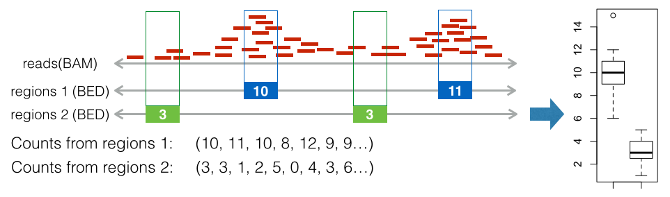

# Method description

## Category 1: Tests for regions versus regions

Tests for regions versus regions require two types of inputs, one is the reference regions and the other is the query regions. Both of the reference and the query are in BED format. The common aim of the below tests is to evaluate the association between the reference and the query.

### Projection Test

The projection test uses binomial test to evaluate the association between the reference and the query by the following processes:

* Convert the query regions into spatial points by the midpoint of each region.
* Calculate the background proportion (P) by the coverage of the reference.
* Count the number of overlaps between the reference regions and the query points.
* Performing binomial test by background proportion as success probability, number of overlaps as success number, and number of regions in the query as number of trials.

The projection test requires large reference regions which has large coverage on the genome, because the small background proportion, which is caused by small coverage, will result in bias in binomial test.

### Intersection Test
The intersection test provides a more intuitive way to measure the association between reference and query by counting the number of intersections directly.

The reference and the query should have real overlap, otherwise nothing can be calculated. One more assumption is needed: no internal overlap within the reference itself (or query itself) exists. The internal overlap within reference or query may cause bias because of the overestimation of the intersection between reference and query.

### Jaccard Test
There is another way to measure the intersection between the reference and the query, which is the Jaccard index (also called Jaccard similarity coefficient). The basic concept of the Jaccard index, given two sets A and B, is the ratio of their intersection (A∩B) to their union (A∪B). Through this Jaccard index, the amount of intersection can be expressed by a value between zero to one.

### Combinatorial Test
The intersection test can draw the inference of the association between the reference and the query directly from their intersected regions, but it cannot find the association among various combinations of the different references. For example, if the query is associated to the presence of one reference and the absence of the other reference, this association cannot be approached by the intersection test because only one reference is considered.

The criteria for the reference and the query selection for the combinatorial test is different than the previous tests. The previous tests examine the association between each reference and each query. By contrast, combinatorial test uses the different combinations of the references to compare their intersection numbers among the different queries. Therefore, the sizes among references as well as the sizes among queries should not vary too much.

## Category 2: Tests for regions versus signals

### Boxplot

Boxplot is introduced to compare sets of reads from different ChIP-seq experiments on the given regions. Based on all the intersection vectors, boxplot is generated. Conceptually, the generation of boxplot is simply counting the number of reads within the each interested regions, then plot these counts in boxplot.

### Lineplot & Heatmap
The boxplot can detect the overlaps between reads and the given region, but not their spatial distribution around the region. In order to find the signal of reads for a particular position, boxplot does not provide enough information. Therefore, lineplot and heatmap are introduced here to display the spacial distribution of reads for the particular positions.

The whole process of lineplot or heatmap is described as following:

1. Extend each region with the given window size which defines the boundaries for plotting. Make all regions having the same length.

2. Calculate the coverage of reads on the given regions according to the given bin size and step size. The bin is a smaller fragment which moves through the window according to the defined step size. In each step, the number of reads within the bin is counted. This approach is called sliding window read counting, which generate more smooth signal than direct counting for the regions in boxplot [3]. Through this strategy, the signal can be smoothed and still preserve its local distribution.

3. Plotting the lineplot or heatmap. The lineplot takes the average of the counting numbers on all the extended regions (windows), but will lose the information of single data points. The heatmap displays all information even including the counting of single bin. The lineplot shows the genome-wide trend of the signal which gets obscured by the heatmap.

### Reference

1. Alexander Favorov, Loris Mularoni, Leslie M. Cope, Yulia Medvedeva, Andrey A. Mironov, Vsevolod J. Makeev, and Sarah J. Wheelan. Exploring massive, genome scale datasets with the genometricorr package. PLoS computational biology, 8(5):1002529, 2012.

2. Raimundo Real and Juan M. Vargas. The probabilistic basis of jaccard’s index of similarity. Systematic biology, pages 380–385, 1996.

3. Tarjei S Mikkelsen, Manching Ku, David B Jaffe, Biju Issac, Erez Lieberman, Georgia Giannoukos, Pablo Alvarez, William Brockman, Tae-Kyung Kim, Richard P Koche, et al. Genome-wide maps of chromatin state in pluripotent and lineage-committed cells. Nature, 448(7153):553–560, 2007.
