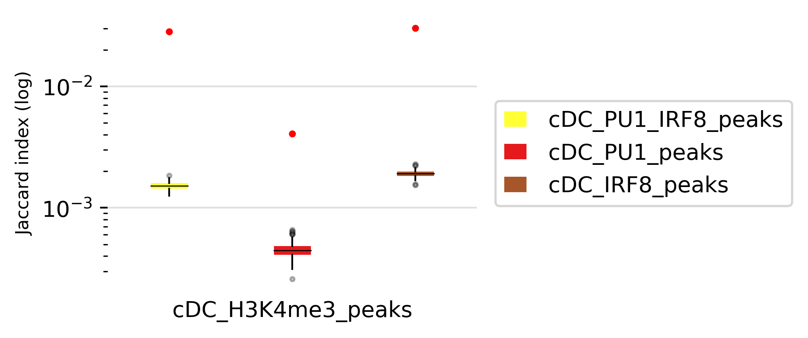
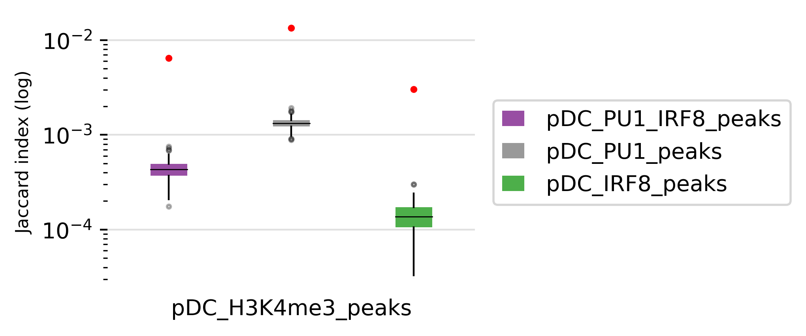

# Tutorial of regions versus regions

In this tutorial, we will demonstrate how we can use RGT-Viz to visualize association among different region sets.

## Download the data

We will use the epigenetic data from dendritic cell development study as example. There, we have ChIP-Seq data from the transcription factor **PU.1** and **IRF8**, and histone modifications **H3K4me1**, **H3K4me3**, **H3K9me3**, **H3K27me3**, and **H3K27ac** on four cellular states: multipotent progenitors (MPP), dendritic cell progenitors (CDP), common dendritic cells (cDC) and plamatocyte dendritic cells (pDC). The functional annotation of these histone markers are showed as follows:

* H3K4me1 is enriched at active and primed enhancers;
* H3K4me3 is highly enriched at active promoters near Transcription start site (TSS);
* H3K9me3 is a marker of heterochromatin which has pivotal role during lineage commitement;
* H3K27me3 is associated with the downregulation of nearby genes via the formation of heterochromatic regions;
* H3K27ac is accociated with the higher activation of transcription and defined as an active enhancer marker.

The peaks of **PU.1** and **IRF8** are further processed into 3 groups: overlapping peaks of PU.1 and IRF8, PU.1 peaks (no IRF8), and IRF8 peaks (no PU.1). Those files are listed below:
* PU1_IRF8_pDC_overlap_peaks.bed
* PU1_pDC_noIRF8_peaks.bed
* IRF8_pDC_noPU1_peaks.bed
* PU1_IRF8_cDC_overlap_peaks.bed
* PU1_cDC_noIRF8_peaks.bed
* IRF8_cDC_noPU1_peaks.bed

Next, please download the folder “rgt_viz_example” from [here](https://costalab.ukaachen.de/open_data/RGT/rgt_viz_example.zip).

```shell
unzip rgt_viz_example
cd rgt_viz_example
```

Now you have the files as described below:

```shell
data/
├── bw
│   ├── H3K27ac_cDC.bw
│   ├── H3K27ac_CDP.bw
│   ├── H3K27ac_MPP.bw
│   ├── H3K27ac_pDC.bw
│   ├── H3K27me3_cDC.bw
│   ├── H3K27me3_CDP.bw
│   ├── H3K27me3_MPP.bw
│   ├── H3K27me3_pDC.bw
│   ├── H3K4me1_cDC.bw
│   ├── H3K4me1_CDP.bw
│   ├── H3K4me1_MPP.bw
│   ├── H3K4me1_pDC.bw
│   ├── H3K4me3_cDC.bw
│   ├── H3K4me3_CDP.bw
│   ├── H3K4me3_MPP.bw
│   ├── H3K4me3_pDC.bw
│   ├── H3K9me3_cDC.bw
│   ├── H3K9me3_CDP.bw
│   ├── H3K9me3_MPP.bw
│   ├── H3K9me3_pDC.bw
│   ├── IRF8_cDC.bw
│   ├── IRF8_pDC.bw
│   ├── PU1_cDC.bw
│   ├── PU1_CDP.bw
│   ├── PU1_MPP.bw
│   └── PU1_pDC.bw
└── peaks
    ├── H3K4me3_cDC_WT_peaks.bed
    ├── H3K4me3_CDP_WT_peaks.bed
    ├── H3K4me3_MPP_WT_peaks.bed
    ├── H3K4me3_pDC_WT_peaks.bed
    ├── PU1_IRF8_cDC_overlap_peaks.bed
    ├── IRF8_cDC_noPU1_peaks.bed
    ├── PU1_cDC_noIRF8_peaks.bed
    ├── PU1_IRF8_pDC_overlap_peaks.bed
    ├── IRF8_pDC_noPU1_peaks.bed
    └── PU1_pDC_noIRF8_peaks.bed
```

These directories include the genomic signals of histone modifications (files with a .bw ending as generated by [bamCoverage](https://deeptools.readthedocs.io/en/develop/content/tools/bamCoverage.html)) and the genomic regions of PU.1 and IRF8 peaks (files with .narrowPeak endings as generated by [MACS2](https://genomebiology.biomedcentral.com/articles/10.1186/gb-2008-9-9-r137)) in different DC cells.

## Projection test

Projection test evaluates the association between a set of region sets (peaks of Irf8, PU1 and Irf8/PU1) vs. a background regions (H3K4me3 peaks in cDC cells) by evaluating intersection counts with a random binomial model.

```shell
rgt-viz projection -r Matrix_H3K4me3.txt -q Matrix_cDC_pDC.txt -o results -t projection -c factor -organism mm9 -g cell
```

- -r is reference region set as the base for statistics;
- -q is query region set for testing its association with the reference regions;
- -o indicates the output directory;
- -t defines the title of this experiment;
- -c defines the color tag for cloring the test;
- -organism defines the genome assembly used here;
- -g defines the group tag for grouping the test.

This command will generate a directory “<em>results/projection</em>” with figures and html pages.

<p align="center">

</p>

These results indicates 

## Jaccard test

Jaccard test evaluates the association level by comparing with jaccard index from repeating randomization.

```shell
rgt-viz jaccard -r Matrix_H3K4me3_cDC_pDC.txt -q Matrix_cDC_pDC.txt -o results -t jaccard -organism mm9 -g cell
```

This command will generate a directory “<em>results/jaccard</em>” with figures and html pages.

<p align="center">

</p>

<p align="center">

</p>

## Intersection test

Intersection test provides various modes of intersection to test the association between references and queries.

Firstly, you can run intersection test without statistical test. This mode is faster to get a descriptive result:

```shell
rgt-viz intersect -r Matrix_H3K4me3_cDC_pDC.txt -q Matrix_cDC_pDC.txt -o results -t intersection -organism mm9
```

<p align="center">

</p>


However, you can also run it with statistical test by randomization of query regions. This take more compuational resources.

```shell
rgt-viz intersect -r Matrix_H3K4me3_cDC_pDC.txt -q Matrix_cDC_pDC.txt -o results -t intersection -organism mm9 -stest 100
```

- -stest defines the repitition times of random subregion test between reference and query. The more repitition times are, the more reliable the result is. However, it take time to run.

## Combinatorial test

Another variant of intersection test is combinatorial test which check all the combinations of the given query regions and calcuate their intersections to the reference. This test is useful in exploring the unknown association between region sets.

```shell
rgt-viz combinatorial -o results -q Matrix_H3K4me3_cDC_pDC.txt -r Matrix_PU1_IRF8_peaks.txt -t combinatorial -organism mm9 -g cell -c factor
```

<p align="center">

</p>
