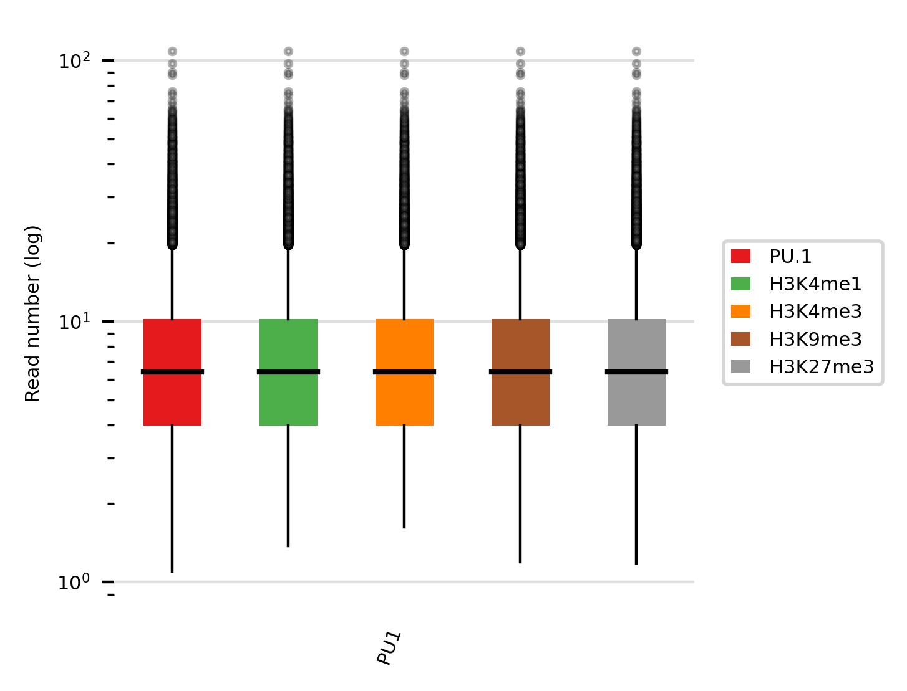
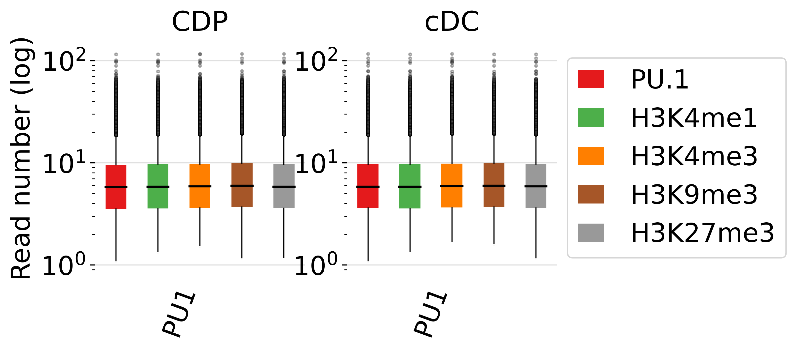
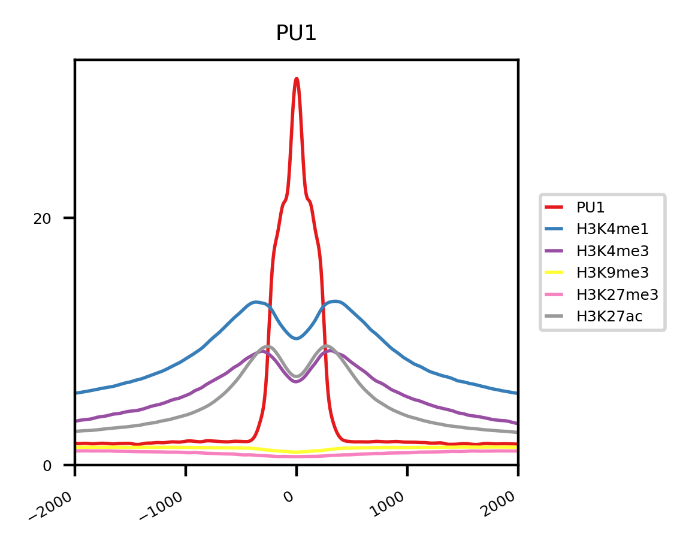
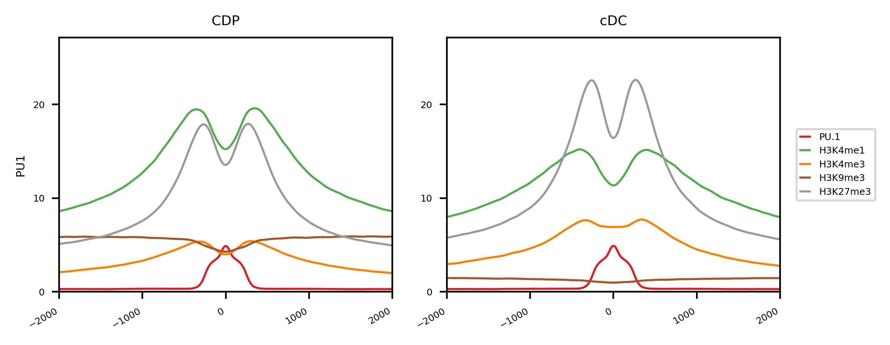
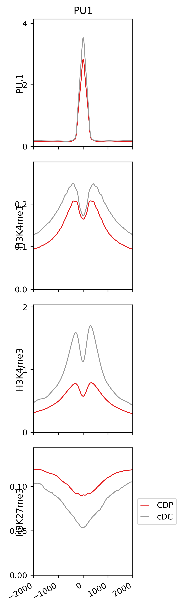
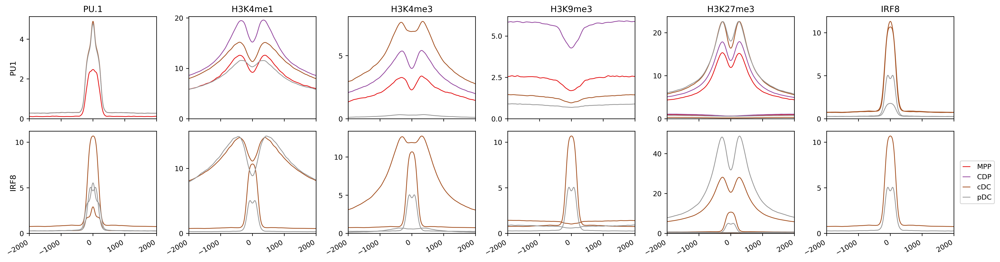
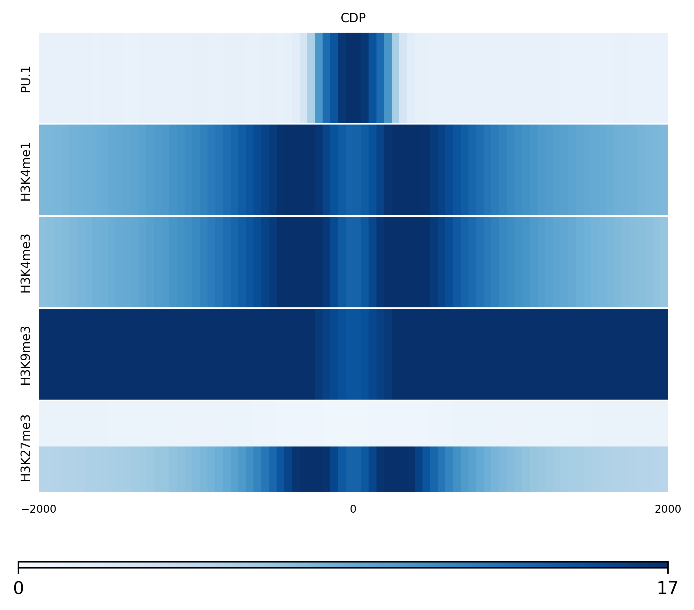
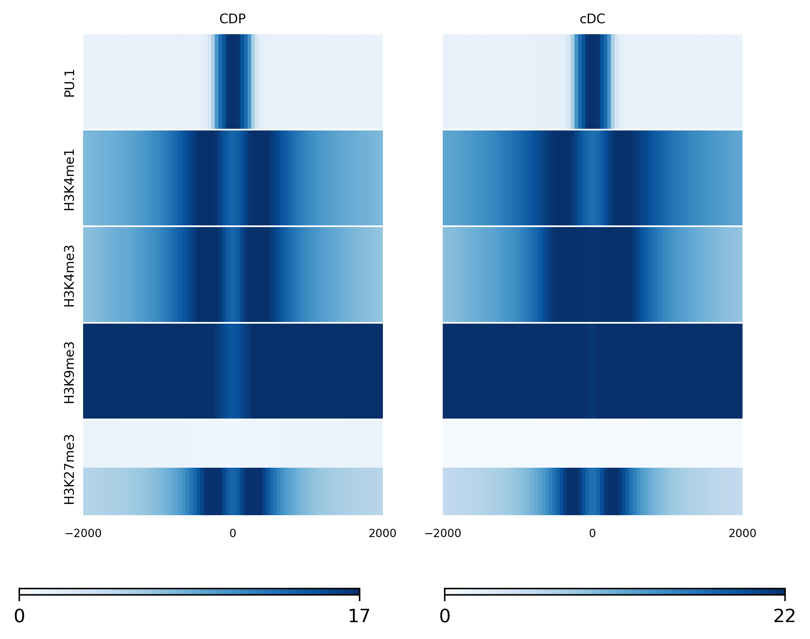
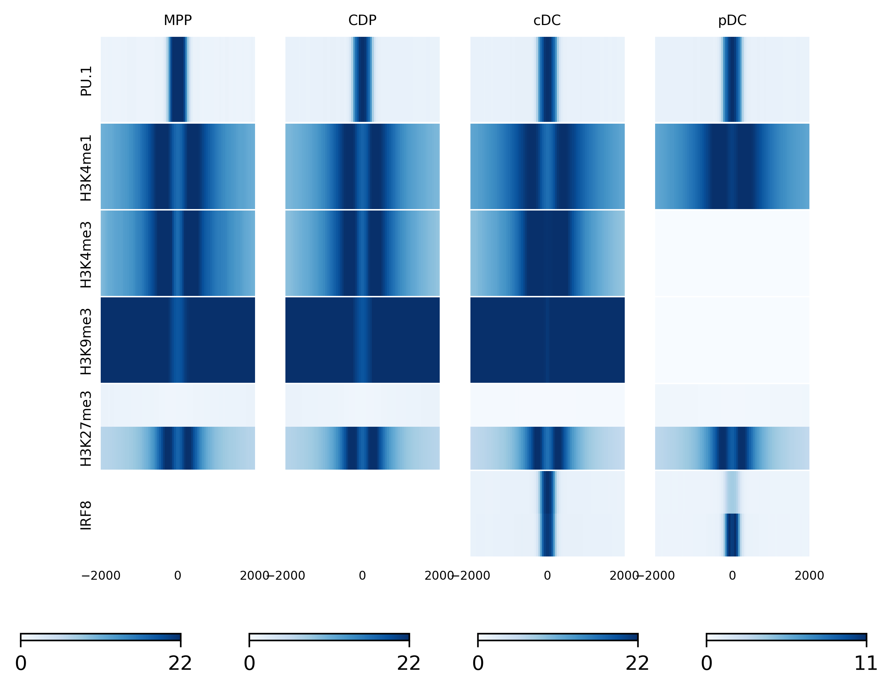

# Tutorial of regions versus signals

In this tutorial, we will demonstrate how we can use RGT-Viz to visualize signlas in different regions.

## Download the data

We will use the epigenetic data from dendritic cell development study as example. There, we have ChIP-Seq data from the transcription factor **PU.1** and **IRF8**, and histone modifications **H3K4me1**, **H3K4me3**, **H3K9me3**, **H3K27me3**, and **H3K27ac** on four cellular states: multipotent progenitors (MPP), dendritic cell progenitors (CDP), common dendritic cells (cDC) and plamatocyte dendritic cells (pDC). The functional annotation of these histone markers are showed as follows:

* H3K4me1 is enriched at active and primed enhancers;
* H3K4me3 is highly enriched at active promoters near Transcription start site (TSS);
* H3K9me3 is a marker of heterochromatin which has pivotal role during lineage commitement;
* H3K27me3 is associated with the downregulation of nearby genes via the formation of heterochromatic regions;
* H3K27ac is accociated with the higher activation of transcription and defined as an active enhancer marker.

Next, please download the folder “rgt_viz_example” from [here](https://costalab.ukaachen.de/open_data/RGT/rgt_viz_example.zip).

```shell
unzip rgt_viz_example
cd rgt_viz_example
```

Now you have the files as described below:

```shell
└── data
    ├── bw
    │   ├── H3K27ac
    │   ├── H3K27me3
    │   ├── H3K4me1
    │   ├── H3K4me3
    │   ├── H3K9me3
    │   ├── IRF8
    │   └── PU1
    └── peaks
        ├── IRF8
        └── PU1
```

These directories include the genomic signals of histone modifications (files with a .bw ending as generated by [bamCoverage](https://deeptools.readthedocs.io/en/develop/content/tools/bamCoverage.html)) and the genomic regions of PU.1 and IRF8 peaks (files with .narrowPeak endings as generated by [MACS2](https://genomebiology.biomedcentral.com/articles/10.1186/gb-2008-9-9-r137)) in different DC cells.


## Creating Line Plots with RGT-Viz

Here we demonstrate how we can use RGT-Viz for drawing a lineplots. This allows for example to inspect the ChIP-Seq signals around particular genomic regions, as PU.1. peaks. Before you proceed, please [install RGT-Viz](https://reg-gen.readthedocs.io/en/latest/rgt/installation.html).

### Understand experimental matrix

Before we use the RGT-Viz, you must define an experimental matrix. This tab separated file includes information necessary for RGT to understand your data, i.e. file paths, protein measured in the ChIP-Seq experiment, type of file and so on.

For example “<em>Matrix_CDP.txt</em>”  includes the files, which we need for finding the association of genomic signals on the genomic peaks of PU.1 transcription factor.

| name       	 | type	   | file			                        | factor   | cell |
| :------------- | :------ | :--------------------------------------| :------- | :--- |
| CDP\_PU1\_peaks| regions | ./data/peaks/PU1_CDP_peaks.narrowPeak  | PU1      | CDP  |
| CDP\_PU1       | reads   | ./data/bw/PU1_CDP.bw		            | PU.1     | CDP  |
| CDP\_H3K4me1   | reads   | ./data/bw/H3K4me1_CDP.bw               | H3K4me1  | CDP  |
| CDP\_H3K4me3   | reads   | ./data/bw/H3K4me3_CDP.bw               | H3K4me3  | CDP  |
| CDP\_H3K9me3   | reads   | ./data/bw/H3K9me3_CDP.bw               | H3K9me3  | CDP  |
| CDP\_H3K27me3  | reads   | ./data/bw/H3K27me3_CDP.bw               | H3K27me3  | CDP  |
| CDP\_H3K27ac   | reads   | ./data/bw/H3K27ac_CDP.bw               | H3K27ac  | CDP  |

The first column (name) is a unique name for labeling the data; the second column indicate the type of experiment. Here we have either “regions” (genomic regions in bed format) or “reads” (genomic signals in bigwig or bam format). The third column is the file path to the data. You can include additional columns to annotate your data.  In our example, the 4th column (factor) indicates the protein measured by the ChIP-Seq and the 5th collumn indicates the cell, where experiments were performed. You can add any more columns and the column names identify the feature.

## Boxplot

After defining the experiment matrix, now you can simply run RGT-Viz under “<em>rgt\_viz\_example</em>” directory by: 

```shell
rgt-viz boxplot Matrix_CDP.txt -o results -t boxplot_CDP -g None -c reads -s regions
```

Boxplot is used to show the signal on the regions and present their association by p-values. The above command includes the parameters such as:
- Matrix\_CDP.txt is the experimental matrix which contains the design of the data;
- -o indicates the output directory;
- -t defines the title of this experiment;
- -g defines how we group the analyses;
- -c defines how we want to color the bars in the boxplot;
- -s defines how we sort the data on the axis of row.

This command generates the following result:

<p align="center">

</p>

<p align="center">

</p>

We can also combine another cell type in the experimental matrix for a more complicated result:

```shell
rgt-viz boxplot Matrix_CDP_cDC.txt -o results -t boxplot_CDP -g None -c reads -s regions
```

<p align="center">

</p>

## Lineplot

The next example is to generate lineplot which shows the average of the signal across the defined regions by a sliding window. You can run it with the command below:

```shell
rgt-viz lineplot Matrix_CDP.txt -o results -t lineplot_CDP
```

- Matrix\_CDP.txt is the experimental matrix which contains the design of the data;
- -o indicates the output directory;
- -t defines the title of this experiment.

This command will generate a directory “<em>results</em>” with figures and html pages. You can check the result by opening <em>results/index.html</em>

<p align="center">

</p>

This lineplot shows the genomic signals of different histone modifications on the PU.1 genomic regions in CDP. The histone modifications are shown in different colors, and the window is centered by the midpoint of each genomic regions from PU.1 peaks.

### Add one more cell type

Lineplot is designed to compare more categories of data. Here we show another example to include one more cell type, cDC.

```shell
rgt-viz lineplot Matrix_CDP_cDC.txt -o results -t lineplot_CDP_cDC -col cell -row regions -srow
```

- <em>Matrix\_CDP\_cDC.txt</em> is the experimental matrix which contains the design of the data;
- -col defines the way to group data in columns, here we use “cell”, which is one of the headers in <em>Matrix\_CDP\_cDC.txt</em>;
- -row defines the way to group data in rows, here we use “regions”;
- -sx shares the y-axis for the plots in the same row.

<p align="center">

</p>

This lineplot shows the difference of histone signatures on the PU.1 peaks among two cells. This plot indicates an increase in PU.1 and H3K4me3 levels on cDC cells compared to CDP cells.

For better comparison of each genomic signal, we can also plot them in different way, such as:

```shell
rgt-viz lineplot Matrix_CDP_cDC.txt -o results -t lineplot_CDP_cDC_2 -c cell -row regions -col reads 
```

- -c defines the way to color the lines, here we use “cell” as the tag to show different cells in different colors;
- -row defines the way to group data in rows, here we use “regions”;
- -col defines the way to group data in columns, here we use “reads”.

<p align="center">

</p>

This design offer better comparison between cells by separating different histone modification and show cells in different colors.

Therefore, by changing the experimental matrix or the way to present, you can generate more complicated lineplot for comparison of your data across cell types, treatments, histone modification, or any other designs. RGT-Viz allows several other plots variants.

### More complicated setting

Here we want to demonstrate the capacity to visulize the signals in a more complicated setting. This matrix now has 2 peaks of interest, 4 cell types, and 6 ChIP-Seq signals. Please check the file <em>Matrix\_all\_cells.txt</em> and run the command below:

```shell
rgt-viz lineplot Matrix_all_cells.txt -o results -t lineplot_all -c cell -row regions -col reads
```

You will get this result:
<p align="center">

</p>

## Heatmap

We also have another way to present the data with heatmap. Heatmap is a feature of lineplot command with a parameter `-heatmap`. Here are the example commands and their results.

```shell
rgt-viz lineplot Matrix_CDP.txt -o results -t heatmap_CDP -heatmap -row reads -col cell -c regions
```

<p align="center">

</p>

```shell
rgt-viz lineplot Matrix_CDP_cDC.txt -o results -t heatmap_CDP_cDC -heatmap -row reads -col cell -c regions
```

<p align="center">

</p>

```shell
rgt-viz lineplot Matrix_all_cells.txt -o results -t heatmap_all -heatmap -row reads -col cell -c regions
```

<p align="center">

</p>

## References

1. Lin Q, Chauvistre H, Costa IG, Mitzka S, Gusmao EG, Haenzelmann S, Baying B, Hennuy B, Smeets H, Hoffmann K, Benes V, Sere K, Zenke M, Epigenetic and Transcriptional Architecture of Dendritic Cell Development, Nucleic Acids Research, 43:9680-9693, [[paper]](http://nar.oxfordjournals.org/content/early/2015/10/15/nar.gkv1056.full)[[data]](http://www.ncbi.nlm.nih.gov/geo/query/acc.cgi?acc=GSE64767)[[genome tracks]](http://www.molcell.rwth-aachen.de/dc/)


