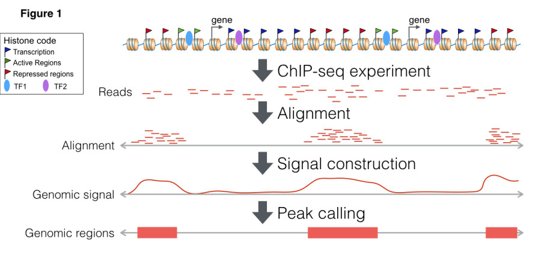
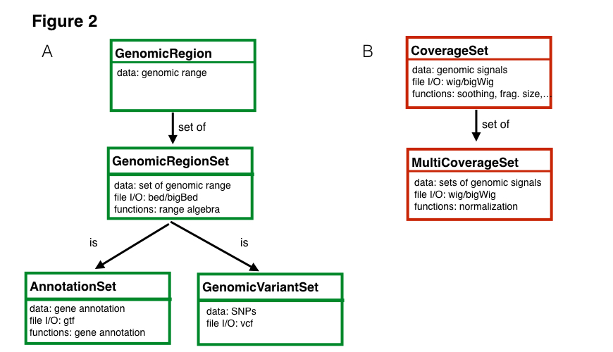

# Introduction

Regulatory Genomics Toolbox (RGT) is an open source python library for analysis of regulatory genomics. RGT is programmed in an oriented object fashion and its core classes provide functionality for handling regulatory genomics data. This library has been used for implementation of several tools as ChIP-Seq differential peak callers ([THOR](https://reg-gen.readthedocs.io/en/latest/thor/introduction.html)), ATAC/DNase-seq footprinting method ([HINT](https://reg-gen.readthedocs.io/en/latest/hint/introduction.html)), motif bindng sites analysis ([Motif analysis](https://reg-gen.readthedocs.io/en/latest/motif_analysis/introduction.html)) and the visualization tool [RGT-Viz](https://reg-gen.readthedocs.io/en/latest/rgt-viz/introduction.html).

Figure 1 shows a typical pipeline for analysis of histone modifications. First, ChIP-Seq reads are mapped to the genome with a general aligner. Then, a peak caller is used to find regions with locations of the histone modifications. Peak callers usually use/provide two types of representations: genomic signals, which reflect the number of ChIP-Seq reads mapped to particular genomic positions, and genomic regions, which represent the regions where the histone modifications are located.

The example above requires two main data types. First, we have the set of genomic regions (or genomic ranges), which can be used to represent sets of transcription factor binding sites, ChIP-Seq peaks or ATAC-seq peaks. RGT also implements genomic region set operations (intersection, union and difference, among others), which are commonly required for integrative analysis of regulatory genomics data. Another important data structure is coverage set, which store genomic signals of ChIP-Seq or any targeted sequencing technique. Coverage set can be seen as a compression of read alignment results and is used for medium level analysis methods. Coverage set classes provide functions for pre-processing of genomic signals adopted by our tools THOR and HINT, i.e. fragment extension estimation, smoothing, CG content bias correction, normalization, among others. 

Moreover, RGT provides input and output functions of typical genomic format files such as read alignments (BAM files), genomic profiles (wig/bigWig files) and genomic regions (bed, vcf files). Finally, RGT include classes for handling genome annotations, such as transcript and gene from standard formats (gtf files) and motif databases (transfac format). These core classes provide a powerful infrastructure for development of methods for regulatory genomics. Check out the documentation for more details of classes and supported methods.

RGT currently provides functionality for all steps of basic analysis pipelines of ChIP-Seq and DNase-Seq data. Check our [tool usage](https://reg-gen.readthedocs.io/en/latest/rgt/tool_usage.html) describing a complete pipeline for analysis of TF ChIP-Seq data including the implementation of your own peak caller.
