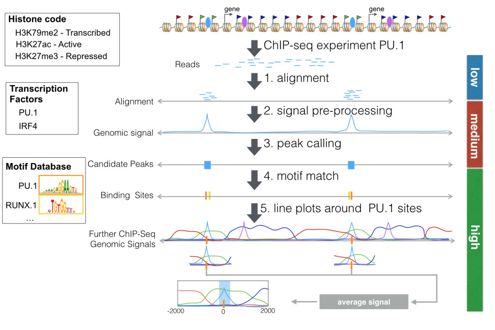

# Tool Usage

RGT and its tools can be used to analyze ChIP-Seq data from transcription factor. We will use data from a biological study measuring histone modifications and the transcription factor PU.1 during dendritic cell differentiation [1]. Figure below depicts all steps of the pipeline analyzing PU.1 ChIP-Seq data. First, a  ChIP-Seq experiment produces reads around interaction sites of a protein of interest. After quality control, reads are aligned to the genome (step 1). This low level analysis can be performed with any general read mapper, such as [bwa](http://bio-bwa.sourceforge.net/). This tutorial will not cover low level analysis steps.

Next, we use a peak caller to find regions in the genome, which are likely to be bound by the PU.1. A peak caller receives read alignments as input. Peak callers usually generate an intermediary representation of the read alignments called “genomic signal”. Next, they perform a statistical test to detect regions with higher reads than in other genomic regions. These candidate peaks represents the regions with DNA-protein interaction. In this tutorial, we will show how you can [implement your own peak caller](https://reg-gen.readthedocs.io/en/latest/rgt/tutorial-peak-calling.html) using functionality provided by RGT with very few lines (steps 2-3).

Usually several high level analyses are performed on candidate peaks. A typical analysis is to evaluate how other genomic data is associated to your ChIP-Seq peaks. We will show here how you can [create line plots with RGT-Viz](https://reg-gen.readthedocs.io/en/latest/rgt-viz/tutorial.html) to explore association between PU.1 peaks and histone modifications. These line plots display average “genomic signals” of other ChIP-Seq experiments around the predicted PU.1 peaks (step 5). For ChIP-Seq experiments of transcription factor, it is relevant to find motifs of the transcription factor and its potential co-binding factors (step 4). We will show here how to use the [Motif Analysis](https://reg-gen.readthedocs.io/en/latest/motif_analysis/tutorial.html) tool for this task.

### Reference 

1. Lin Q, Chauvistre H, Costa IG, Mitzka S, Gusmao EG, Haenzelmann S, Baying B, Hennuy B, Smeets H, Hoffmann K, Benes V, Sere K, Zenke M, Epigenetic and Transcriptional Architecture of Dendritic Cell Development, Nucleic Acids Research, 43:9680-9693, [[paper]](http://nar.oxfordjournals.org/content/early/2015/10/15/nar.gkv1056.full)[[data]](http://www.ncbi.nlm.nih.gov/geo/query/acc.cgi?acc=GSE64767)[[genome tracks]](http://www.molcell.rwth-aachen.de/dc/).

