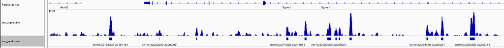

# Tutorial - Implementing your own Peak Caller

We explain how to use RGT to implement your own  peak caller for a single ChIP-Seq profile. The peak caller can account for control input-DNA and can normalize against the GC content. We output the identified peaks in BED format, and the computed ChIP-Seq signal, that is, the genomic signal, in bigwig format. For this task will provide [aligned reads](https://costalab.ukaachen.de/open_data/RGT/peak_calling_example_data.zip) from the PU.1 ChIP-Seq experiments of common dendritic cells (cDC). For computational simplicity, we only provide reads for chromosome 19.
	
For this tutorial, you need to have RGT [installed](https://reg-gen.readthedocs.io/en/latest/rgt/installation.html) and configured to work with mouse genome 9 ([see configuration of genomic data](https://reg-gen.readthedocs.io/en/latest/rgt/setup_data.html)).

## Preprocessing Steps

First, to work on genomic signals and create wig/bigWig files, we need to known the chromosome sizes. For this, we use <em>GenomeData</em> and the method <em>get\_chrom\_sizes\_as\_genomicregionset</em> from our <em>helper</em> class. We create an instance of <em>GenomeData</em> and use the helper function to obtain a <em>GenomicRegionSet</em> indicating the size of chromosomes. In this example, we work on the mouse genome version 9 (mm9). We thereby ensure that our peak caller knows the chromosome sizes.

```python
from rgt.Util import GenomeData
from rgt.helper import get_chrom_sizes_as_genomicregionset
g = GenomeData('mm9') 
regionset = get_chrom_sizes_as_genomicregionset(g.get_chromosome_sizes())
```

Before reading the ChIP-seq signal profiles, we need to compute the fragment size of the reads.  We use THOR’s extension size calculation to perform this step.

```python
from rgt.THOR.get_extension_size import get_extension_size
bamfile = 'PU1_cDC.final.bam'
ext, _ = get_extension_size(bamfile, start=0, end=300, stepsize=5)
```

Next, we create an instance of <em>CoverageSet</em> and load the ChIP-Seq reads. We use regionset, which describes the entire genome, as base for the CoverageSet. We thereby consider all aligned reads in the BAM file.

```python
from rgt.CoverageSet import CoverageSet
cov = CoverageSet('IP coverage', regionset)
cov.coverage_from_bam(bam_file=bamfile, extension_size=ext)
```

In ChIP-Seq analysis, one should correct the IP ChIP-seq signals with input-DNA signals. We create a further <em>CoverageSet</em> instance and load the corresponding BAM file.

```python
cov_input = CoverageSet('input-dna coverage', regionset)
bamfile_input = 'input.final.bam'
cov_input.coverage_from_bam(bam_file=bamfile_input, extension_size=0)
```

We then normalize our ChIP-Seq data. First, we normalize against the GC-content. Second, we subtract the input-DNA data from the IP data.

```python
cov.norm_gc_content(cov_input.coverage, g.get_genome(), g.get_chromosome_sizes())
cov.subtract(cov_input)
```

We have now preprocessed our ChIP-seq data. In a next step, we perform the actual peak calling.

## Peak Calling

A peak caller simply needs to scan the genomic coverage object and detect regions with significantly high number of reads.  Our working assumption is that for a ChIP-seq experiment the reads falling into a bin follow a Binomial distribution. The Binomial distribution has two parameters s and p, which represent respectively the number of events and the probability of an event. Here, the number of events is simply the number of reads in the ChIP-seq library.  The probability of a event is the chance a read lies into a bin and can be estimated as as the average number of reads per bin (ignoring bins with zero counts) divided by the library size.

```python
from numpy import sum, mean
s = sum(cov.overall_cov)
p = mean(cov.overall_cov[cov.overall_cov > 0]) / s
```

We apply a binomial test to check if a particular bin has higher reads count than expected by change.  As usual in peak caller, we ignore bins with low number of reads (>10), as they are uniquely to represent peaks. This also speeds up computation.

```python
from scipy.stats import binom_test
def filter_peaks(c, empirical_s, empirical_p, pvalue_theshold=0.05, min_reads=10):
    p = binom_test((c, s-c), p=empirical_p) if c > min_reads else 1
    return True if p < pvalue_theshold else False
```

Next, we create an instance of <em>GenomicRegionSet</em> which serves to store identified peaks.

```python
from rgt.GenomicRegionSet import GenomicRegionSet
res = GenomicRegionSet('identified_peaks')
```

The peak calling needs to iterate over all bins in the genome.  This is stored in the variable <em>overall\_cov</em> of the <em>CoverageSet</em> class. The exact genomic position of the list elements can be obtained by the function <em>index2coordinates</em>. The function <em>filter\_peaks</em> will indicate if the evaluated region is a peak or not. If we consider the genomic position a peak, we save it in our res object.

```python
from rgt.GenomicRegion import GenomicRegion
for i, c in enumerate(cov.overall_cov):
    if filter_peaks(c, s, p):
        chrom, s, e = cov.index2coordinates(i, regionset)
        res.add(GenomicRegion(chrom, s, e+1))
```

We use e+1 as ending coordinate, such that the considered bin overlap in one position. Finally, we merge consecutive bin to one single peak.

```python
res.merge()
```

## Postprocessing Steps

Finally, we output the identified peaks in a BED file. Furthermore, we output the computed ChIP-seq signal in a bigwig file, which can be open by your favorite genome browser.

```python
res.write('run_peaks.bed')
cov.write_bigwig('run_signal.bw', g.get_chromosome_sizes())
```

And that is all! Here is a screenshot of the results visualized by [IGV](https://www.broadinstitute.org/igv/). We show <em>run\_peaks.bed</em> and <em>run\_signal.bw</em>.



Check [here](https://costalab.ukaachen.de/open_data/RGT/rgt_viz_example.zip) for a bit more sophisticated coding of this peak caller. In particular, we use a lookup table for the p-values scipy’s binomial test is computing. Hence, the peak caller is much more efficient. As a exercise, you can program the  peak caller in an object orient fashion, i.e. by making it an extension of the CoverageSet class.


