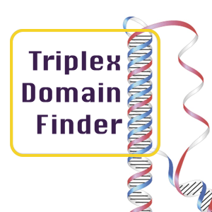

# Introduction



## Method

Triplex Domain Finder (TDF) characterizes the triplex-forming potential between RNA and DNA regions. Our method tests whether particular RNA regions are likely to form DNA binding domains (DBD)  in the given lncRNA to the potential target DNA regions (e.g. promoters of differentially regulated genes after knockdown of the lncRNA).

Moreover, DNA binding sites associated with the predicted DBDs are used to indicate potential target DNA regions, e.g. genes with high binding site coverage in their promoter. TDF provides two distinct statistical tests:

*  **promoter test** – used to evaluate the triple helix potential in promoters
* **genomic region test** – used to test triple helix potential in a given set of genomic regions

The command line tool provides results in a user friendly and graphical HTML interface.

## Installation

### Installation of TDF

* If you have followed the generic instructions for the [RGT suite installation](https://reg-gen.readthedocs.io/en/latest/rgt/installation.html), then you can start using TDF.
* If you have any questions, comments, installation problems or bug reports, please report in our [Github page](https://github.com/CostaLab/reg-gen/issues).

### Configure genome sequence and annotation data

Before performing the test, the genome sequence and annotation data should be configured. Previous installation of wget is required for Mac OS (see [complete installation](https://reg-gen.readthedocs.io/en/latest/rgt/setup_data.html)).
```shell
cd ~/rgtdata
python setupGenomicData.py --mm9
python setupGenomicData.py --hg38
```

Note that this operation will require a few minutes for completion and will download genome FASTA files.

## Example Promoter Test

We will describe the necessary steps to find potential DNA binding domains of Fendrr in the promoter region of genes UP/DOWN regulated after Fendrr siRNA as presented in the [TDF publication](https://academic.oup.com/nar/advance-article/doi/10.1093/nar/gkz037/5304312?searchresult=1).

To run TDF with the **promoter test**, you need as input:

* the FASTA ([What is FASTA?](http://de.wikipedia.org/wiki/FASTA-Format))
* the gene list in form of gene symbol or ensembl id

You can download data for executing TDF on Fendrr example [here](https://costalab.ukaachen.de/open_data/TDF/TDF_examples.zip) and find two files in **FENDRR_mm9** directory:

* Fendrr.fasta: The sequence of Fendrr in FASTA format.
* fendrr_gene_list.txt: A list of genes UP/DOWN regulated after Fendrr siRNA.

### Run promoter test

Go to the directory with these files (**FENDRR_mm9/**). The promoter test can be executed with the following command:
```shell
rgt-TDF promotertest -r FENDRR.fasta -de fendrr_gene_list.txt -organism mm9 -rn FENDRR -o promoter_test/FENDRR/ -l 20
```

After running the command,  all the result files are in the output directory (**promoter_test/Fendrr/**) with html report: promoter_test/Fendrr/index.html (see [result webpage here](https://costalab.ukaachen.de/open_data/TDF/FENDRR_mm9/promoter_test/index.html)). Complete usage instructions and more descriptive examples are found here.

### Example Genomic Region Test
The genomic region test uses any set of genomic locations as target regions. This test should be used when target DNA regions are indicated by functional studies, such as ChIRP-Seq, CHART-Seq or ChIP-Seq.

Genomic region test requires two files: a RNA sequence in FASTA format and a set of interested genomic regions in BED format.

Before running the test, please make sure you configure the hg38 genome data ([here](https://reg-gen.readthedocs.io/en/latest/rgt/setup_data.html)). We demonstrate the genomic region test with the following files in MEG3_hg38 from example data obtained [here](http://costalab.org/files/tdf/TDF_examples.zip):

* **MEG3_sequence.fa**: RNA sequence of MEG3 in FASTA format.
* **MEG3_hg38_CHOP.bed**: Potential target regions of MEG3.

### Run genomic region test
Go to the directory with the files and execute the following command to run the test:
```shell
rgt-TDF regiontest -r MEG3_sequence.fa -bed MEG3_hg38_CHOP.bed -rn MEG3 -organism hg38 -o genomic_region_test/MEG3 -n 100 -l 14
```

Then all the results and graphics are stored in the output directory (**genomic_region_test/MEG3**) (check example results page [here](https://costalab.ukaachen.de/open_data/TDF/MEG3_hg38/genomic_region_test/index.html)).

Complete usage instructions and more descriptive examples are found in tutorial for genomic region test.

## Example – TRIPLEXES

You can also use TDF command line to make use of functionally of TRIPLEXES. First, we show how to list all triple helices for a given pair of RNA and DNA regions similar as Triplexator. We use MEG3 as the example to show how to run TRIPLEXES to find all the triplexes between lncRNA MEG3 and MEG3 CHOP regions.

```shell
cd TDF_examples/MEG3_hg38/
rgt-TDF get_TTS -i MEG3_hg38_CHOP.bed -tts MEG3_TTSs.bed -r MEG3_sequence.fa -organism hg38
```

Then TRIPLEXES reports:
```shell
Total binding events: 118
```

with two files as below:

* **MEG3_TTSs.bed**: A BED file for all predicted TTSs.
* **MEG3_TTSs.txp**: A tab-delimited text file for statistics of triplexes.

Another unique feature of TRIPLEXES is the detection of auto binding sites in a given genome. In this case you only need to specify the DNA regions, as TRIPLEXES will look for all DNA position forming a triple helix to a transcript potentially expressed at the same loci. Note that we allow the TFO and TTS to be shifted by a small number of bases, 5bps as default. Here we take mm9 genome as the example:

```shell
rgt-TDF autobinding -i /data/rgtdata/mm9/genome_mm9.fa
```

## Citation
Chao-Chung Kuo, Sonja Hänzelmann, Nevcin Sentürk Cetin, Stefan Frank, Barna Zajzon, Jens-Peter Derks, Vijay Suresh Akhade, Gaurav Ahuja, Chandrasekhar Kanduri, Ingrid Grummt, Leo Kurian, Ivan G Costa; Detection of RNA–DNA binding sites in long noncoding RNAs, Nucleic Acids Research, gkz037, https://doi.org/10.1093/nar/gkz037