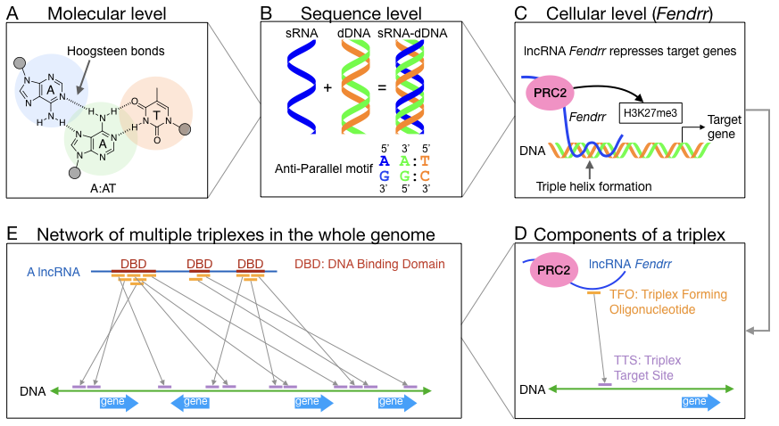

# Method Description

## General Concept

The brief overview of triplexes in molecular, sequence, and celluar levels with further explanation of the computational problems:

* (A) Triplexes are formed via Hoogsteen hydrogen bonds between individual nucleobases of the RNA strand (blue) and the Watson-Crick base pairs of the DNA double strand (green and orange). A A:AT triplet is shown here as example.
* (B) The presence of homopurine-homopyrimidine sequences and the orientation of RNA dictates triplex formation. Here we show base paring rules for the anti-parallel triplex motif as an extension of the previous example (A:AT triplet).
* (C) LncRNA can bind to DNA region via triplex formation and recruit chromatin remodeling proteins to repress (or activate) target genes. Here lncRNA Fendrr is shown as an example for binding its target gene via triplex formation and recruiting PRC2 (polycomb repressive complex 2) to trimethylates histone H3 on lysine 27 (i.e. H3K27me3).
* (D) The binding of one single triplex between Fendrr and DNA is illustrated here to introduce Triplex Forming Oligonucleotide (TFO) and Triplex Target Site (TTS). TFO binds to TTS according to the matching motif.
* (E) Given a lncRNA, multiple triplexes can be formed throughout the whole genome. The TFOs often cluster together and these overlapping TFOs are defined as DNA Binding Domain (DBD) where lncRNA actively form triplexes with DNA.

Triplex Domain Finder (TDF) uses [TRIPLEXES](https://github.com/CostaLab/Triplexes) to find TFOs (Triplex Forming Oligonucleotides) and TTSs (Triplex Target Sites) of a lncRNA in DNA target regions. One set of regions comprises potential lncRNA targets (target regions), e.g. promoters of genes differentially expressed after FENDRR knockdown. A second set defined as non-target regions comprises promoters of genes not differentially expressed. Next, we list all candidate DNA binding domains (DBDs) by finding regions in the RNA with overlapping TFOs (see figure below). We only consider candidate DBDs with more than k TTSs in target regions. Finally, we test whether the number of target regions with at least one TTSs is higher than the number of non-target regions with at least one TTS for a given DBD. 

## Promoter Test
The promoter test evaluates the triple helix binding potential of a lncRNA in the promoters of candidate genes, e.g. genes differentially expressed in a particular functional study. For this, it compares binding statistics on the promoters of candidate genes (target regions) with the binding statistics in all other promoters (non-target regions).

## Genomic Region Test
The genomic region test evaluates the triple helix binding potential of a lncRNA in a set of regions in the DNA, as indicated by genome-wide essays measuring the interaction of lncRNAs with DNA (ChIRP-Seq and CHART-Seq). Due to lack of a non-target region set, we select random genomic regions as non-target regions and use an empirical statistical test. This test evaluates whether the number of target regions with at least one DBS is larger than the number of non-target regions with at least one DBS.

Exact details are provided here:

Chao-Chung Kuo, Sonja Hänzelmann, Nevcin Sentürk Cetin, Stefan Frank, Barna Zajzon, Jens-Peter Derks, Vijay Suresh Akhade, Gaurav Ahuja, Chandrasekhar Kanduri, Ingrid Grummt, Leo Kurian, Ivan G Costa; Detection of RNA–DNA binding sites in long noncoding RNAs, Nucleic Acids Research, gkz037, https://doi.org/10.1093/nar/gkz037