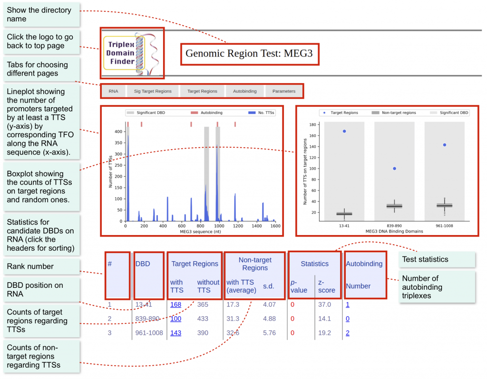
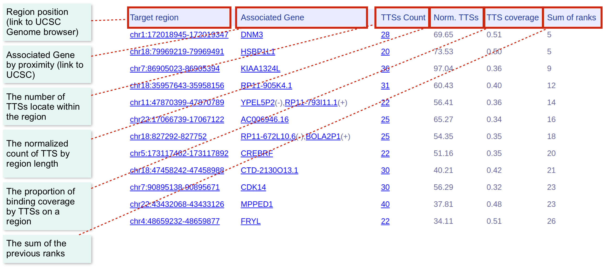

# Tutorial for genomic region test

## Basic

The genome data of hg38 should be already configured ([How to configure genome data](https://reg-gen.readthedocs.io/en/latest/rgt/setup_data.html)).

Genomic region test requires one RNA sequence and a set of interesting target regions:

* **RNA sequence**: A file in FASTA format. For known lncRNAs, you can download their sequences from the UCSC Genome Table Browser.
* **Target regions**: A BED file, which contains the regions of interest.

### Example data
To demonstrate the genomic region test, we use MEG3 as an example. In the example files ([download here](https://costalab.ukaachen.de/open_data/TDF/TDF_examples.zip)), you can find the folder “MEG3_hg38“. There are several files:

* **MEG3_sequence.fa**: RNA sequence of MEG3 in FASTA format.
* **MEG3_hg38_CHOP.bed**: Potential target regions of MEG3.

You can use the following command to see all the arguments related to the genomic region test:

```shell
rgt-TDF regiontest
```

### Analysis by default setting
Given the RNA sequence and interested regions, it is easy to perform the test with the default arguments.
Command:
```shell
rgt-TDF regiontest -r MEG3_sequence.fa -bed MEG3_hg38_CHOP.bed -rn MEG3 -organism hg38 -o genomic_region_test/MEG3
```

where **-r** is the lncRNA sequence, **-bed** is the region of interest, **-rn** defines the lncRNA name, **–organism** defines the organism, and **-o** is the output directory.

Then, the result webpages and graphics are stored in **genomic_region_test/MEG3/**

You can simply open **genomic_region_test/MEG3/index.html** to see all the results and graphics. (see Demo [here](https://costalab.ukaachen.de/open_data/TDF/MEG3_hg38/genomic_region_test/MEG3/index.html))

### Result Interface

There are three main pages for each test.

* **RNA page**: Shows statistics and graphics of candidate DBDs.
* **Target region page**: Shows DBSs statistics for all target regions and rankings.
* **Parameters page**: Shows the parameters used by TDF.

The main page is the RNA, which will display the main statistics regarding the candidate DBDs. Here, you can find which DBD binds significantly to the target regions.



The second page shows the statistics of target regions potentially forming triplexes with a given RNA. It is possible to define the region with the highest binding possibility and its associated gene.



## Advanced options for the genomic region test

We will describe a few relevant options of TDF. See the tool usage for description of all options.

### How to change the number of randomization?
The default randomization processes is performed for 10,000 times. You can change it by the argument -n.
```shell
rgt-TDF regiontest -r MEG3_sequence.fa -bed MEG3_hg38_CHOP.bed -rn MEG3 -organism hg38 -o genomic_region_test/MEG3 -n 100
```

### How to change minimum length and error tolerance of triple helix binding sites
When the predicted binding sites are too less to analyze, you can decrease the minimum length (-l) or increase the percentage error tolerance (-e) as follows:
```shell
rgt-TDF regiontest -r MEG3_sequence.fa -bed MEG3_hg38_CHOP.bed -rn MEG3 -organism hg38 -o genomic_region_test/MEG3 -n 100 -l 14 -e 20
```

### How to output target regions and DBSs in BED format

Sometimes we want to output the interested regions in BED format for further investigation. TDF can output target promoters and TTSs on target promoters by adding an argument, -obed:
```shell
rgt-TDF regiontest -r MEG3_sequence.fa -bed MEG3_hg38_CHOP.bed -rn MEG3 -organism hg38 -o genomic_region_test/MEG3 -n 100 -obed
```

Three BED files will appear in the output directory:

* **MEG3_target_region_dbs.bed**: The target regions which have at least one TTS within it.
* **MEG3_dbss.bed**: All TTSs between lncRNA and target regions.
T
he file name MEG3 is defined by output directory name.

### Remove temporary files

TDF generates some temporary files such as .fa and .txp. They can be removed in order to save memory usage by the argument, -rt:
```shell
rgt-TDF regiontest -r MEG3_sequence.fa -bed MEG3_hg38_CHOP.bed -rn MEG3 -organism hg38 -o genomic_region_test/MEG3 -n 100 -obed -rt
```
