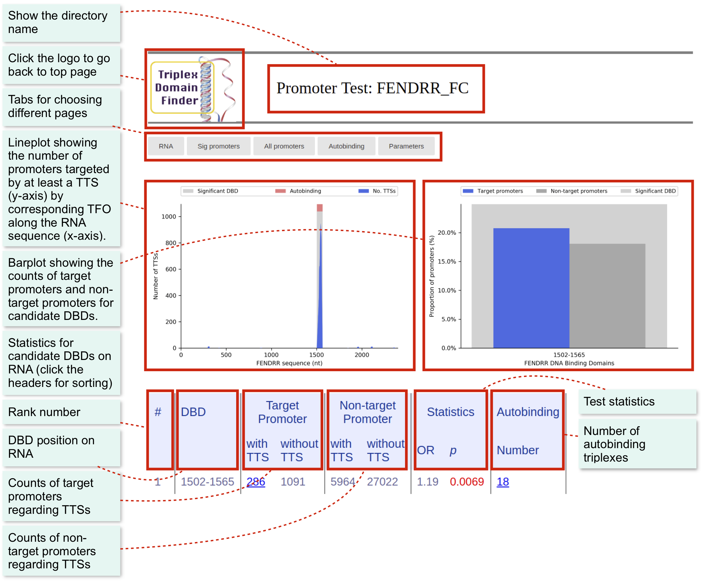
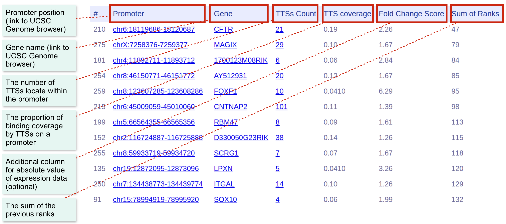

# Tutorial for promoter test

## Basic

The genome data of mm9 should already be configured ([How to configure genome data](file:///Users/zhijianli/Github/reg-gen/docs/_build/html/rgt/setup_data.html)).

The promoter test requires an RNA sequence and a list of differentially expressed genes. Their format should be as following:

* RNA sequence: A file in FASTA format. For known lncRNAs, you can download their sequence from databases, such as [UCSC Genome Table Browser](http://genome.ucsc.edu/cgi-bin/hgTables?command=start).
* Gene list: A plain text file with one gene symbol (or Ensembl ID) per line. You may get them from your experiment or interested targets.

### Example data
For demonstrating promoter test, we use FENDRR as an example. In the example files (download [here](http://costalab.org/files/tdf/TDF_examples.zip)), you can find the folder “FENDRR_mm9“. There are three files:

* **FENDRR.fasta**: RNA sequence of FENDRR in FASTA format.
* **fendrr_gene_list.txt**: A plain text file with differentially expressed gene names.
* **fendrr_gene_list_ford_change.txt**: A tab separated file containing gene name (first column) and absolute fold-change (second column) . The fold change information will be used as user provided experimental evidence to rank candidate target promoters.

You can use the following command to see all the arguments related to promoter test.
```shell
rgt-TDF promotertest
```

### Analysis with default setting
Given the example sequence and gene list, it is easy to perform the test with the default arguments.

Command:
```shell
rgt-TDF promotertest -r FENDRR.fasta -de fendrr_gene_list_fold_change.txt -rn FENDRR -organism mm9 -o promoter_test/FENDRR/
```

where **-r** is the lncRNA sequence, **-de** is the gene list, **-rn** is the name of the lncRNA, **-organism** defines the organism and **-o** is the path to output result files. Here, we use the gene list with fold change as example.

The result webpages and graphics are stored in **promoter_test/FENDRR/**

You can simply open **promoter_test/FENDRR/index.html** to see all the results and graphics (or see [here](https://costalab.ukaachen.de/open_data/TDF/FENDRR_mm9/promoter_test/FENDRR_FC/index.html) an HTML output).

### Result Interface
There are three main pages for each test.

* **RNA page**: Show statistics and graphics of candidate DBDs within the given RNA.
* **Sig promoters**: Show all the statistics of triplexes formed by the significant DBDs.
* **All promoters**: Show all the statistics of triplexes formed by the all DBDs.
* **Autobinding**: Show the statistics of autobinding triplexes.
* **Parameters page**: Show the parameters used by TDF.

The main page is “RNA”, which will display main statistics regarding the candidate DBDs.



You can see the Sig Promoters Page by selecting the corresponding tab. The page shows all target promoters ranked by a criteria of choice. Simply click at the header of each column to resort columns.



## Advanced options for TDF
We will describe a few relevant options of TDF. See the tool usage for a description of all options.

### How to change the length of promoters
The default length of promoter is 1000 bp. If you want to change it into 2000, you can add an argument, -pl, as below:
```shell
rgt-TDF promotertest -r FENDRR.fasta -rn FENDRR -de fendrr_gene_list.txt -organism mm9 -o promoter_test/FENDRR_2000/ -pl 2000
```

### How to change minimum length and error tolerance of binding sites
You can also change relevant Triplexator parameters, as the size of the triple helix binding size (-l) and the maximin error tolerance  (-e) as following:
```shell
rgt-TDF promotertest -r FENDRR.fasta -rn FENDRR -de fendrr_gene_list.txt -organism mm9 -o promoter_test/FENDRR_l15e25/ -l 15 -e 15
```

### How to output target promoters and DBSs in BED format
TDF also generated BED files with DNA binding sites in BED format for further investigation. TDF can output target promoters and DBSs on target promoters by adding the argument, -obed:

```shell
rgt-TDF promotertest -r FENDRR.fasta -rn FENDRR -de fendrr_gene_list.txt -organism mm9 -o promoter_test/FENDRR_obed/ -obed
```

Three BED files will be generated in the output directory:

* FENDRR_target_promoters.bed – target promoter generated in TDF
* FENDRR_target_promoters_dbs.bed – target promoters with at least on DBS
* FENDRR_dbss.bed – DNA binding sites

### How to remove temporary files
TDF generates some temporary files such as .fa and .txp. They can be removed in order to save disk space using the argument, -rt:

```shell
rgt-TDF promotertest -r FENDRR.fasta -rn FENDRR -de fendrr_gene_list.txt -organism mm9 -o promoter_test/FENDRR_rt/ -rt
```


