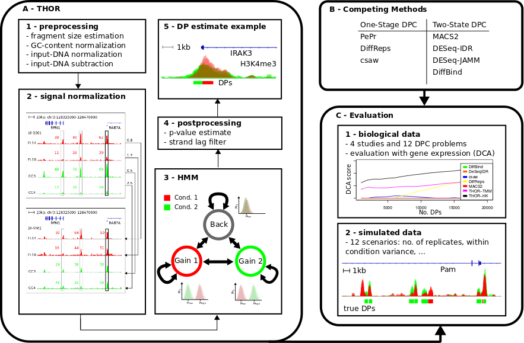

# Introduction


## Method
THOR is an Hidden Markov Model based approach to detect and analyze differential peaks in two sets of ChIP-seq data from distinct biological conditions with replicates. THOR performs genomic signal processing, peak calling and p-value calculation in an integrated framework. See below the overall workflow of THOR.



## Basic Usage
You can find [here](https://costalab.ukaachen.de/open_data/RGT/THOR/THOR_example_data.tar.gz) example files containing reads aligned to selected genomic regions from a B Cell lymphoma [study](http://www.sciencedirect.com/science/article/pii/S1074761314004889). These files are from two donors with follicular lymphoma (FL) and two control samples (CC). We are interested in the differential peaks between the biological conditions FL and CC. The files are based on our experiment LYMP-FL-CC described in our paper.

### Run THOR
The following command finds differential peaks in the two conditions (here FL and CC):

```shell
rgt-THOR THOR.config
```

THOR.config contains all necessary files for THOR to run:

```shell
#rep1
FL5_H3K27ac.100k.bam
FL8_H3K27ac.100k.bam
#rep2
CC4_H3K27ac.100k.bam
CC5_H3K27ac.100k.bam
#chrom_sizes
hg19.chrom.sizes
```

THOR needs 3 types of files:

* BAM files for the first biological condition
* BAM files for the second biological condition
* The chromosome sizes

The file hg19.chrom.sizes is contained in the example files as well. It is a tab limited file with the chromosome name and the chromosome size. See here how to get the chromosome sizes for further organisms.

In the config file, we can also incorporate the genome (with header #genome) and control input-DNA files (with headers #inputs1 and #inputs2). This improves the accuracy of the differential peak estimates. See here for a more advanced example.

### Results 
THOR creates several files. If we do not specify anything, THOR uses THOR-exp-<date> as experiment name by default.

The file(s) are:

| **File**                     | **Description**                          |
| :--------------------------  | :-------------------------------------   |
| THOR-exp-<date>-s1-rep0.bw   | postprocessed ChIP-seq signal (in bigWig format) for the first BAM file in the first biological condition (here: FL5)    |
| THOR-exp-<date>-s1-rep1.bw   | postprocessed ChIP-seq signal (in bigWig format) for the second BAM file in the first biological condition (here: FL8)   |  
| THOR-exp-<date>-s2-rep0.bw   | postprocessed ChIP-seq signal (in bigWig format) for the first BAM file in the second biological condition (here: CC4)   |
| THOR-exp-<date>-s2-rep1.bw   | postprocessed ChIP-seq signal (in bigWig format) for the second BAM file in the second biological condition (here: CC5)  |
| THOR-exp-<date>-setup.info   | information about the experiment setting |
| THOR-exp-<date>-diffpeaks.bed | differential peaks in a proprietary BED format |
| THOR-exp-<date>-diffpeaks.narrowPeak | differential peaks in narrowPeak format |

Please, see [here](https://reg-gen.readthedocs.io/en/latest/thor/tool_usage.html) for a more detailed description of the output, in particular of the \*setup.info, \*bed and \*narrowPeak file.

For downstream analysis of the BED file, we provide two [tools](https://costalab.ukaachen.de/open_data/RGT/THOR/THOR-tools.tar.gz). The first tool separates the BED file by differential peaks that gain peaks in condition 1 and that gain peaks in condition 2. The second tool filters the BED file by p-value. The 11th column in the BED file gives a semicolon separated list for each differential peak. The first (second) element of the semicolon separated list contains a comma separated list of the counts of each replicate of the first (second) biological conditions. The third element of the list gives the calculated p-value. Column 6 (strand) indicates whether a DP gaining condition 1 (+) or condition 2 (-) was found. Column 9 gives a colour code for the peaks (red for a differential peak in signal 1, and green for a differential peak in signal 2).

Here, we provide a screenshot of the results based on [IGV](http://www.broadinstitute.org/igv/):


## Citation

Allhoff, M., Sere K., Freitas, J., Zenke, M.,  Costa, I.G. [Differential Peak Calling of ChIP-seq Signals with Replicates with THOR](http://nar.oxfordjournals.org/content/early/2016/08/01/nar.gkw680.abstract). Nucleic Acids Research, 44(20):e153, 2016.

